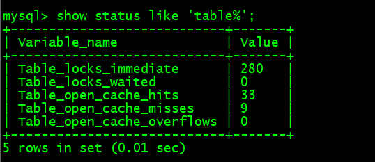
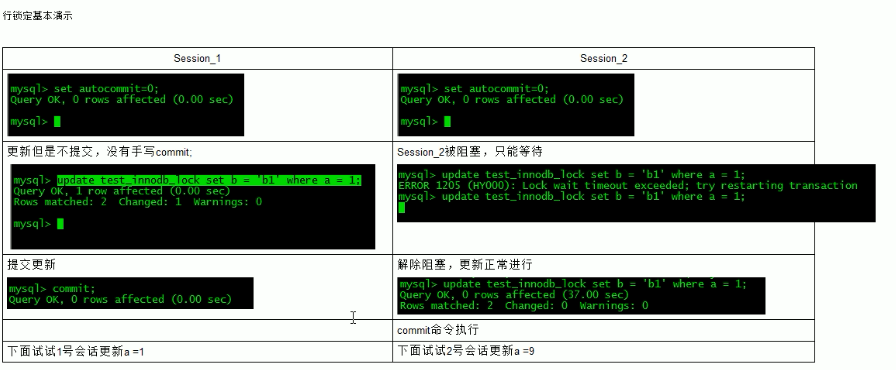
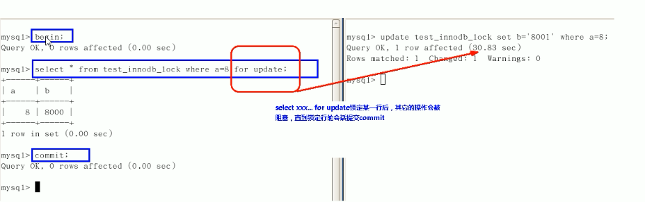
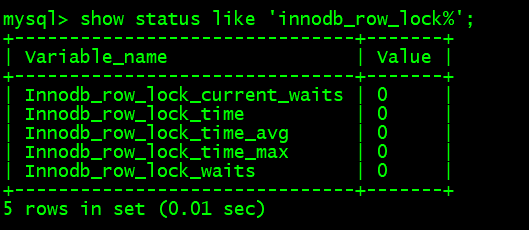

### 事物

- 事务是逻辑上的一组操作，要么都执行，要么都不执行。
- 四个特性：
  
  - **原子性**： 事务是最小的执行单位，不允许分割。
  
  - **一致性**：执行事务前后，数据保持一致。
  
  - **隔离性**：并发访问数据库时，一个用户的事务不被其他事务所干扰。
  - **持久性**： 一个事务被提交之后。它对数据库中数据的改变是持久的。
- 并发事物带来的问题：
- **丢失更新**：最后的更新覆盖了其他事务已经提交的更新。
  - **脏读**：事务A读到了事务B已修改但尚未提交的数据。

  - **不可重复读**：事务A读到了事务B已经提交的修改数据。

  - **幻读(虚读)**：事务A读到了事务B已经提交的新增数据。
- 隔离级别
  - **READ-UNCOMMITTED(读未提交)：**允许读取尚未提交的数据变更。
  - **READ-COMMITTED(读已提交)**：允许读取并发事务已经提交的数据。
  - **REPEATABLE-READ(可重复读)：**mysql默认级别， 对同一字段的多次读取结果都是一致的。
  - **SERIALIZABLE(可串行化)：** 最高的隔离级别，所有的事务依次逐个执行，这样事务之间就完全不可能产生干扰。
  查看当前数据库隔离级别：`show variables like 'tx_isolation';`


### 存储引擎

- 存储引擎是数据库底层的软件组织，数据库管理系统通过存储引擎进行增删查改。存储引擎主要有InnoDB、MyISam、Memory、Archive等。
- mysql5.5之前默认使用MyISam为默认存储引擎，5.7开始采用InnoDB为默认存储引擎。  
查看mysql提供的所有存储引擎：`show engines;`  
查看默认存储引擎：`show variables like '%storage_engine%';`  
查看具体某个表的存储引擎：`show table status like "table_name";`  

- InnoDB与MyISam不同之处：

  1. **锁**：InnoDB支持行级锁(row-level locking)和表级索(table-level locking)，默认行级锁；MyISam只支持表级索。

  2. **事务、崩溃后恢复**：MyISam查询具有原子性，速度比InnoDb快，但不支持事务；InnoDb提供事务支持事务，具有事务(commit)、回滚(rollback)和崩溃修复能力(crash recovery capabilities)的事务安全(transaction-safe (ACID compliant))型表。

  3. **是否支持外键**： MyISAM不支持，而InnoDB支持。

  4. **MVCC**：即多版本并发控制，InnoDB支持，MyISam不支持。

#### MVCC

- mvcc是一种提高并发的技术，只在读已提交和重复读两个隔离级别下工作，不同的数据库对mvcc的实现不统一，即可以使用悲观锁来实现也可以使用乐观锁来实现。一般MVCC有2种实现方法：
	- 写新数据时，把旧数据转移到一个单独的地方，比如mysql，oracle。
	- 写新数据时，旧数据不删除，而是把新数据插入，比如PostgreSQL。
	
- 在InnoDB的实现中，InnoDB向数据库的每一行添加三个隐藏字段：
	- 6字节的DB_TRX_ID：事务ID。标识最近一次对本行记录做修改的事务的标识符
	- 7字节的DB_ROLL_PTR：回滚指针。指向当前记录项的undo信息。
	- 6字节的DB_ROW_ID：随着新行插入单调递增的一个字段。当由innodb自动产生聚集索引时，聚集索引包括这个DB_ROW_ID的值，不然的话聚集索引中不包括这个值。

	​        当一个事物更改某行数据时，就会用排它锁锁定该行，修改当前行的值，填写事物编号，并且把当前行的值拷贝到一个叫undo log的表中，使回滚指针指向undo log中修改的当前行，当另外一个事物也对当前行操作时，就会通过来控制数据的版本。
	
	[参考一](https://segmentfault.com/a/1190000012650596)
	      
	[参考二](https://github.com/zhangyachen/zhangyachen.github.io/issues/68)

### 索引

- 索引是排好序的快速查找的数据结构。一般来说索引本身也很大，不可能全部存储在内存中，因此索引往往以文件形式存储在硬盘上。索引是在存储引擎层实现的，而不是在服务器层实现的，所以不同存储引擎具有不同的索引类型和实现。

- 优缺点：
  - 降低数据库IO成本；降低CPU消耗。
  - 提高查询速度，但降低了增删改的速度；索引自身是保存了主键和索引列字段的表，也需要占空间。

- 分类：

  - 单值索引：即一个索引只包含单个列，一个表可以有多个单列索引。
  - 复合索引：即一个索引包含多个列。
  - 唯一索引：索引列的值必须唯一，但允许有空值。
  - 覆盖索引：索引列包含了查询的字段。(即select 后面的字段都已建立索引)
  - **聚簇(集)索引**：数据行的物理顺序与列值(一般是主键那一列)的逻辑顺序一致，并且叶节点就是数据结点。一张表只能有一个聚簇索引。
  - **非聚簇(集)索引**：索引的逻辑顺序与数据行的物理存储顺序不一致，叶节点有指针指向数据块，需进行二次查询，一张表能有多个非聚簇索引。
  
 #### B-Tree、B+Tree

  - 平衡二叉树缺点：
    - 如果节点很多的话，那么这个AVL树的高度还是会很高的，那么查询效率还是会很低。
    
    - 查询的效率不稳定，还是会有看运气的成分在里面。
    
    - 维护平衡过程的成本代价很高。因为每次删除一个节点或者增加一个节点的话，需要一次或者多次的左旋，右旋等去维护“平衡”状态。
    
    - 节点存储的数据内容太少。没有很好利用操作系统和磁盘数据交换特性，也没有利用好磁盘IO的预读能力。
- 2-3树
  - 2-3树是一种多路查找树，2和3的意思是2-3树包含两种结点：
    - 2结点包含一个元素和两个孩子(或者没有孩子)。左子树的结点的元素值小于该结点的元素值；右子树的结点的元素值大于该结点的元素值。
    - 3结点包含一大一小两个元素和三个孩子(或者没有孩子)。左子树的结点的元素值小于该结点较小的元素值；右子树的结点的元素值大于该结点较大的元素值。
    - 2-3树的所有叶子结点都在同一层次上。
    

<div align="center">  </div><br>
- 2-3-4树类推

  <div align="center">  </div><br>

- B树
  - B树也是一种平衡的多路查找树，2-3树和2-3-4树都是B树的特例。树中结点的最大孩子数为树的阶，通常记为m，2-3树的阶为3,2-3-4树的阶为4。
    - 树中每个结点至多有m颗子树。(即至多含m-1个关键字，两棵子树指针夹着一个关键字)。
    - 若根结点不是终端结点，则至少有两个子树。(至少一个关键字)
    - 除根节点外的所有非叶结点至少有[m/2]棵子树。(至少有[m/2]-1个关键字，[m/2]表示m/2向上取整)
    - 所有叶子结点出现在同一层次上。

- **B树与B+树区别**

  1. **B+树中，n个关键字的结点，含有n棵子树，即每个关键字对应一个子树；
     B树中，n个关键字的结点，含有n+1棵子树，两棵子树指针夹着一个关键字。**
  2. **B+树中，叶结点包含信息，所有非叶结点仅起到索引作用，非叶结点中的每个索引项只包含	对应子树的最大关键字和指向该子树的指针，不含有该关键字对应记录的存储地址；
     B树中，每个关键字对应一个记录的存储地址。**
  3. **B+树中，叶结点包含了全部关键字，即非叶结点中出现的关键字也会出现在非叶结点中，而且叶子结点的指针指向记录；
     B树中，叶子结点包含的关键字和其他结点包含的关键字是不重复的。**
  4. **B+树中，有一个指针指向关键字最小的叶子结点，所有叶子结点连接成一个单链表。**
  5. B +树中，每个非根内部结点关键字个数n取值范围：[m/2] <= n <= m;
     B树中，每个非根内部结点关键字个数为 [m/2] -1  <= n <= m-1

<div align="center">  </div><br>
- **B+树相对B树的优势**
  - **查询操作消耗的时间取决于磁盘IO的次数，而B树的结点包含指针和数据，B+树的结点只包含指针，所以B+树看起来更“矮胖”，同一磁盘页可容纳更多的B+树结点，IO次数就更少。**
  - **B树中进行查询，只要找到匹配元素就行，无论是中间结点还是叶子结点；B+树中进行查询必须查到最终的叶子结点才行，所以B+树更稳定。**
  - **进行范围查询时，B树要中序遍历，而B+树使用链表指针即可，更加方便。**

- 索引SQL

  `create [unique] index [indexname] on table [tablename](column1,column2);`  

  `alter table [tablename] add [unique] index [indexname] on (column1,column2);`  

  `drop index [indexname] on [tablename];`  

  `show index from [tablename];`    
  
- **explain + SQL**
  
  - explain + sql可以查看SQL的执行计划。
  
    <div align="center">  </div><br>
  - **id**：查询的序列号，包含一组数字。id越大，优先级越高，id相同时，执行顺序从上到下。id为null，则表示不需要查询。
    
    - select_type：主要用于区别普通查询、联合查询、子查询等复杂查询。
    - table：从哪个表里查。
    - **type**：表示访问类型。
      1. system：表中只有一行记录。(一般不会出现)
      2. const：通过索引一次就找到了。
      3. eq_ref：对于每个索引键，表中只有一条记录与之匹配，常见于主键或唯一索引扫描。
      4. ref：返回匹配某个单独值的所有行，可能会找到多个符合条件的行。
      5. range：只检索给定范围的行，开始索引的某一点，而结束于另一点，不用扫描全部索引。
      6. index：读全表，从索引中读。
      7. all：读全表，从硬盘中读。
    - possible_keys：显示可能应用在这张表中的索引,一个或多个。
    - **key**：实际使用的索引。如果为null则没有使用索引。
    - key_len：索引最大可能长度，并非实际使用长度。
    - ref：显示索引那一列被使用了，如果可能的话，是一个常数。那些列或常量被用于查找索引列上的值。
    - **rows**：估算查询所需记录需要读取的行。
    - **extra**：包含不适合在其他列中显示但十分重要的额外信息。
      1. using filesort：mysql会对数据使用一个外部的索引排序，而不是按照表内的索引顺序进行读取。
      2. using temporary：使用了临时表保存中间结果。
      3. using index：表示相应的select操作中使用了覆盖索引。

- 索引分析
    两表：左连接时，左表一定全都有，所以要在右表建立索引；右连接同理。
    多表：用小结果集驱动大结果集。优先优化内层循环。
- **索引失效**
> 全值匹配我最爱，最左前缀要遵循；
<div align="center"> </div><br>
> 带头大哥不能死，中间兄弟不能断；
<div align="center">  </div><br> 
> 索引列上少计算，
<div align="center">  </div><br> 
> 范围之后全失效；
<div align="center">  </div><br> 
> like百分写最右，(如果确实要用 %July% ，可以用覆盖索引，查询字段必须是建立了索引的字段)
<div align="center">  </div><br> 
> 覆盖索引不写星；
<div align="center">  </div><br> 
<div align="center">  </div><br> 
> 不等空值还有or，索引失效要少用；
<div align="center">  </div><br> 
<div align="center">  </div><br> 
<div align="center">  </div><br> 
> var引号不能丢，SQL高级也不难。
<div align="center">  </div><br> 
<div align="center">  </div><br> 
<div align="center">  </div><br> 
<div align="center">  </div><br>
<div align="center">  </div><br>
<div align="center">  </div><br>
<div align="center">  </div><br>
<div align="center">  </div><br>
<div align="center">  </div><br>
- 查询截取分析
  1. 慢查询的开启与捕获
  2. explain + 慢SQL分析
  3. show profile查看sql的执行细节和生命周期
  4. 数据库服务器参数调优

- 小表驱动大表
  - 两种方式对比，用第一种。第一种相当于内外建立5次连接，每次连接查询1000次，第二种相当于内外建立1000次连接，每次连接查询5次。

```java
for(int i = 0;i < 5;i ++){
    for(int j = 0;j < 1000; j ++){
        ...
    }
}
```

```ja
for(int i = 0;i < 1000;i ++){
    for(int j = 0;j < 5; j ++){
        ...
    }
}
```

- exits 与 in

	`select * from A where id in (select id from B);`

	相当与
	`select id from B`
	`select * from A where A.id = B.id;`
	
	B为外层循环，A为内层循环，所以，B < A时，用 in。

	`select * from A where exists (select 1 from B where B.id = A.id);`
	
	相当于
	
	`select * from A`
	
	`select * from B where B.id = A.id`
	
	将主查询的数据，放到子查询中做条件验证，根据验证结果(true或者false)来决定主查询数据结果是否保留。
	
	A为外层循环，B为内层循环，索引A < B时，用exist。
	
	```sql
	#select 1只是为了测试表中是否有数据，而不关心数据是什么。表中有多少行记录就返回多少行1,1也可以换成其
	#它常量，比如2,'X'等等。
	select 1 from student
	#exists(subquery)只返回true或者false;
	#效率对比：count(*)=count(1)>count(primary key)>count(column)
	#count(expr)表示对expr不为null的结果集进行计数。1为恒真表达式;count(列)时，会先判断列是否为null。
	```
	
	

- order by
  - mysql支持filesort 和index两种排序方式。filesort效率低，index效率高。oder by字句满足 ”最左前缀要遵循，带头大哥不能死，中间兄弟不能断“ 时，会使用index排序。
  
  - filesort排序的两种算法：
    - 双路排序：MySQL4.1之前是使用双路排序，读取行指针和orderby列，对他们进行排序，然后扫描已经排序好的列表，按照列表中的值重新从列表中读取对应的数据传输。会两次扫描磁盘。
    - 单路排序：从磁盘读取查询需要的所有列，按照orderby列在buffer对它们进行排序，然后扫描排序后的列表进行输出。只需一次IO,因为它把每一行都保存在内存中了。
    
    问题：单路比双路要多占很多空间，因为它是一次性把所有数据都取出来，倘若取出的数据过多，超过了sort_buffer容量，那每次只能取一部分排序，排完序再取再排....会生成临时文件且导致多次IO，效果可能不如双路。
    
    解决方案：
    
    	1. order by 时不要用select *，因为如果字段很多，可能会占满sort_buffer和max_length_for_sort_data。导致产生临时文件和多次IO，效率低。
     	2. 尝试增大sort_buffer
     	3. 尝试增大max_length_for_sort_data
  
<div align="center">  </div><br>
<div align="center">  </div><br>
<div align="center">  </div><br>
- group by
  - where高于having，能在where里限定的条件就不要去having里限定。其他与order by相同。

- 慢查询日志
  - mysql的慢查询日志是用来记录响应时间大于(不是大于等于)long_query_time的SQL语句。默认不会开启，如果不是调优，不建议开。

<div align="center">  </div><br>
<div align="center">  </div><br>
<div align="center">  </div><br>
- mysqldumpslow

  ​	mysqldumpslow可用来分析慢查询日志文件

<div align="center">  </div><br>
<div align="center">  </div><br>
- show profile

  ​	show profile可用来分析当前会话中语句执行的资源消耗情况。

  <div align="center">  </div><br>
开启后，运行
  

`show profiles`

查看最近运行的sql语句及分别的运行时间。

运行

`show profile + 参数 +for query + Query_ID `

查看具体的运行信息。

<div align="center">  </div><br>
当Status中出现如下值时要注意：

	1. converting HEAP to MyISAM：查询结果太大，内存不够用，往磁盘上搬了。
 	2. Creating tmp table：创建了临时表。
 	3. Copying tmp table on disk：把内存中临时表复制到磁盘。
 	4. locked：

参数列表：

<div align="center">  </div><br>
- 全局查询日志

  一般不在生产环境开启。

  ```sql
  set global general_log = 1;
  set global log_output = 'TABLE';
  ...
  执行sql
  ...
  select * from mysql.general_log;#执行的sql就会记录到general_log表里
  ```

  

  <div align="center">  </div><br>

### 锁

#### 表锁
  - 偏向MyISAM存储引擎，开销小，加锁快，无死锁，锁定粒度大，发生锁冲突的概率最高，并发最低。

`show open tables;`查看表是否被锁

`lock table [table1] read/write,[table2] read/write;`给表加锁

`unlock tables;`开锁

session1给table1加读锁后

  - session1和其他session都可以读table1。

- session1不可以修改table1。
- session1不可以读其他的table。

- 其他session修改table1会阻塞，除非session1解锁(unlock tables)table1。

session给table1加写锁后

- session1可以读table1
- session1可以修改table1
- session1不能读其他的table
- 其他session不能读table1,会阻塞，除非session1解锁(unlock tables)table1。

**读锁会阻塞写，不会阻塞读；写锁会把读、写都阻塞**

- 分析表锁定：`show status like 'table%';`

<div align="center">  </div><br>
- Table_locks_immediate：产生表级锁定的次数，表示可以立即获取锁的查询次数。

- **Table_locks_waited**：不能立即获取锁的次数，每等待一次值+1。值较大说明存在严重的表级索争用情况。

  **MyISam锁调度是写锁优先，写锁后，其他线程不能做任何操作，大量更新会使查询很难得到锁。所以不适合做主表引擎。**

#### 行锁

 - 偏向InnoDB存储引擎，开销大，加锁慢；会出现死锁；锁定粒度最小，发生锁冲突的概率最低，并发度也最高。

 <div align="center">  </div><br>
- 无索引行锁升级为表锁
  - **比如varchar类型不写单引号，会进行自动类型转换，使索引失效并且使行锁变为表锁。**

- 间隙锁
  - 当使用范围条件而不是相等条件检索数据时，InnoDB会给符合条件的已有记录加锁，对于键值在在条件范围内但并不存在的记录，叫做间隙。InnoDB也会对这个间隙加锁。这是，其他事务无法插入数据。对性能有危害。

- 锁定一行

<div align="center">  </div><br>
- 行锁分析

`show status like 'innodb_row_lock%'`

<div align="center">  </div><br>
- Innodb_row_lock_time_avg：平均等待时长
- Innodb_row_lock_waits：等待总次数
- Innodb_row_lock_time：等待总时长

### 切分

#### 水平切分

- 水平切分又称为 Sharding，它是**将同一个表中的记录拆分到多个结构相同的表中**。

- 当一个表的数据不断增多时，Sharding 是必然的选择，它可以将数据分布到集群的不同节点上，从而缓存单个数据库的压力。
<div align="center">  </div><br>

- 水平拆分可以支持非常大的数据量。需要注意的一点是：分表仅仅是解决了单一表数据过大的问题，但由于表的数据还是在同一台机器上，其实对于提升MySQL并发能力没有什么意义，所以 **水平拆分最好分库** 。水平拆分能够 **支持非常大的数据量存储，应用端改造也少**，但 **分片事务难以解决** ，跨节点Join性能较差，逻辑复杂。
- **数据库分片的两种常见方案：**
  - **客户端代理：** **分片逻辑在应用端，封装在jar包中，通过修改或者封装JDBC层来实现。** 当当网的 **Sharding-JDBC** 、阿里的TDDL是两种比较常用的实现。
  - **中间件代理：** **在应用和数据中间加了一个代理层。分片逻辑统一维护在中间件服务中。** 我们现在谈的 **Mycat** 、360的Atlas、网易的DDB等等都是这种架构的实现。

#### 垂直切分

- 垂直切分是将一张表按列切分成多个表，通常是按照列的关系密集程度进行切分，也可以利用垂直切分将经常被使用的列和不经常被使用的列切分到不同的表中。

- 在数据库的层面使用垂直切分将按数据库中表的密集程度部署到不同的库中，例如将原来的电商数据库垂直切分成商品数据库、用户数据库等。

<div align="center">  </div><br>

- 垂直拆分的**优点**： 可以使得列数据变小，在查询时减少读取的Block数，减少I/O次数。此外，垂直分区可以简化表的结构，易于维护。
- 垂直拆分的**缺点**： 主键会出现冗余，需要管理冗余列，并会引起Join操作，可以通过在应用层进行Join来解决。此外，垂直分区会让事务变得更加复杂；