* [事物](#%E4%BA%8B%E7%89%A9)
  * [MVCC](#mvcc)
* [数据库三大范式](#%E6%95%B0%E6%8D%AE%E5%BA%93%E4%B8%89%E5%A4%A7%E8%8C%83%E5%BC%8F)
* [delete、truncate、drop区别](#deletetruncatedrop%E5%8C%BA%E5%88%AB)
* [join](#join)
* [存储引擎](#%E5%AD%98%E5%82%A8%E5%BC%95%E6%93%8E)
* [索引](#%E7%B4%A2%E5%BC%95)
  * [B\-Tree、B\+Tree](#b-treebtree)
* [explain查询分析](#explain%E6%9F%A5%E8%AF%A2%E5%88%86%E6%9E%90)
* [索引失效](#%E7%B4%A2%E5%BC%95%E5%A4%B1%E6%95%88)
* [查询截取分析](#%E6%9F%A5%E8%AF%A2%E6%88%AA%E5%8F%96%E5%88%86%E6%9E%90)
  * [查询优化](#%E6%9F%A5%E8%AF%A2%E4%BC%98%E5%8C%96)
    * [小表驱动大表](#%E5%B0%8F%E8%A1%A8%E9%A9%B1%E5%8A%A8%E5%A4%A7%E8%A1%A8)
    * [exists与 in](#exists%E4%B8%8E-in)
    * [exist](#exist)
    * [select 1/count()](#select-1count)
    * [order by](#order-by)
    * [group by](#group-by)
  * [慢查询日志](#%E6%85%A2%E6%9F%A5%E8%AF%A2%E6%97%A5%E5%BF%97)
    * [日志分析工具mysqlDumpSlow](#%E6%97%A5%E5%BF%97%E5%88%86%E6%9E%90%E5%B7%A5%E5%85%B7mysqldumpslow)
  * [show profile查看sql执行的资源消耗情况](#show-profile%E6%9F%A5%E7%9C%8Bsql%E6%89%A7%E8%A1%8C%E7%9A%84%E8%B5%84%E6%BA%90%E6%B6%88%E8%80%97%E6%83%85%E5%86%B5)
  * [全局查询日志](#%E5%85%A8%E5%B1%80%E6%9F%A5%E8%AF%A2%E6%97%A5%E5%BF%97)
* [锁](#%E9%94%81)
  * [表锁](#%E8%A1%A8%E9%94%81)
    * [读锁](#%E8%AF%BB%E9%94%81)
    * [写锁](#%E5%86%99%E9%94%81)
    * [读写锁总结](#%E8%AF%BB%E5%86%99%E9%94%81%E6%80%BB%E7%BB%93)
    * [表锁定分析](#%E8%A1%A8%E9%94%81%E5%AE%9A%E5%88%86%E6%9E%90)
  * [行锁](#%E8%A1%8C%E9%94%81)
    * [行锁演示](#%E8%A1%8C%E9%94%81%E6%BC%94%E7%A4%BA)
    * [无索引行锁升级为表锁](#%E6%97%A0%E7%B4%A2%E5%BC%95%E8%A1%8C%E9%94%81%E5%8D%87%E7%BA%A7%E4%B8%BA%E8%A1%A8%E9%94%81)
    * [间隙锁](#%E9%97%B4%E9%9A%99%E9%94%81)
    * [行锁定分析](#%E8%A1%8C%E9%94%81%E5%AE%9A%E5%88%86%E6%9E%90)
* [切分](#%E5%88%87%E5%88%86)
  * [水平切分](#%E6%B0%B4%E5%B9%B3%E5%88%87%E5%88%86)
  * [垂直切分](#%E5%9E%82%E7%9B%B4%E5%88%87%E5%88%86)

### 事物

- 事务是逻辑上的一组操作，要么都执行，要么都不执行。
- 四个特性：
  
  - **原子性**： 事务是最小的执行单位，不允许分割。
  
  - **一致性**：数据库的完整性约束没有被破坏，事务执行的前后都是合法的数据状态。
  
  - **隔离性**：并发访问数据库时，一个用户的事务不被其他事务所干扰。
  - **持久性**： 一个事务被提交之后。它对数据库中数据的改变是持久的。
- `redo`日志
  - `redo`日志会把事务在执行过程中对数据库所做的所有修改都记录下来，在之后系统崩溃重启后可以把事务所做的任何修改都恢复出来。实现持久性。
  - `InnoDB`存储引擎是以页为单位来管理存储空间的，页大小默认`16K`，在真正访问页之前，需要先把在磁盘上的页缓存到内存的`Buffer Pool`中。同样事务对数据库的操作也是操作的`Buffer Pool`，如果在事务提交后突然发生了某个故障，导致内存中的数据都失效了，那么这个已经提交了的事务对数据库中所做的更改也就跟着丢失了。但我们希望让已经提交了的事务对数据库中数据所做的修改永久生效，即使后来系统崩溃，在重启后也能把这种修改恢复出来。
- `undo` 日志
- `undo`日志就是为了回滚而记录的文件，实现原子性。
  - 如果事务执行时遇到错误，比如突然断电，或者执行了`Rollback`语句时导致事务执行到一半就结束，但是事务执行过程中可能已经修改了很多东西，为了保证事务的原子性，我们需要把数据改回原先的样子。
- 并发事物带来的问题：

  - **丢失更新**：最后的更新覆盖了其他事务已经提交的更新。
  - **脏写**：事务`A`修改了事务`B`已修改但尚未提交的数据。
  - **脏读**：事务`A`读到了事务`B`已修改但尚未提交的数据。
  - **不可重复读**：事务A读到了事务B已经提交的修改数据。
  - **幻读(虚读)**：事务A读到了事务B已经提交的新增数据。
- 隔离级别
  - **READ-UNCOMMITTED(读未提交)**：允许读取尚未提交的数据变更。可能发生脏读、不可重复读、幻读
  - **READ-COMMITTED(读已提交)**：允许读取并发事务已经提交的数据。可能发生不可重复读和幻读问题，不会发生脏读
  - **REPEATABLE-READ(可重复读)**：`mysql`默认级别， 对同一字段的多次读取结果都是一致的。可能发生幻读问题，不会发生脏读和不可重复读
  - **SERIALIZABLE(可串行化)：** 最高的隔离级别，所有的事务依次逐个执行，这样事务之间就完全不可能产生干扰。各种问题都不可以发生。
  - 查看当前数据库隔离级别：`show variables like 'tx_isolation';`
  
#### `MVCC`

  - `mvcc`指在读已提交和可重复读两个隔离级别下，通过控制查询时访问记录的方式使不同事务的`读-写`、`写-读`操作并发执行，从而提升系统性能。
  - 读未提交级别可以读到未提交事务修改的记录，直接读最新版本记录即可，可串行化级别下所有事务依次执行。所以这两个级别不需要`MVCC`。
  - 在`InnoDB`中，`InnoDB`向数据库的每一行添加三个隐藏字段：
  
    - 6字节的`DB_TRX_ID`：事务`id`。标识最近一次对本行记录做修改的事务的id
    - 7字节的`DB_ROLL_PTR`：回滚指针。指向当前记录项的`undo`日志。即当前记录修改前的信息。
    - 6字节的`DB_ROW_ID`(可选)：行`id`，唯一标识一条记录。`Innodb`主键生成策略：优先使用用户定义主键作为主键，如果没有定义，则选取一个`Unique`键作为主键，如果`Unique`键都没有定义的话，则会为表默认添加一个名为`row_id`的隐藏列作为主键。在没有自定义主键以及`Unique`键的情况下才会添加该列。
- 每条记录每次更新后，都会将旧值放到一条`undo`日志中，作为该记录的一个旧版本，随着更新次数的增多，所有的版本都会被`roll_pointer`属性连接成一个链表，这个链表称为`版本链`，版本链的头节点就是当前记录最新的值。另外，每个版本中还包含生成该版本对应的`事务id`。
- 对于读已提交、可重复读两个级别都必须保证读到已经提交了的事务修改过的记录。也就是说假如`A`事务已经修改了记录但尚未提交，`B`事务是不能直接读取的。为此，引入`ReadView`，`ReadView`有4个重要内容

  - `m_ids`：在生成`ReadView`时当前系统中**活跃的事务`id`列表**。
  - `min_trx_id`：在生成`ReadView`时当前系统中**最小的活跃事务`id`**，也就是`m_ids`中的最小值。
  - `max_trx_id`：表示生成`ReadView`时系统中应该分配给**下一个事务的`id`值(未开启的事务)**，即当前最大事务`id + 1`。(事务`id`是递增分配的)
  - `creator_trx_id`：表示生成该`ReadView`的事务的`事务id`，即**当前事务`id`**。

- 可见性比较算法：
  - 有了这个`ReadView`，这样在访问某条记录时，只需要按照下边的步骤判断记录的某个版本是否可见：
    - **如果被访问的记录的`trx_id`小于`min_trx_id`，表明该记录的事务已经提交，所以可以被当前事务访问。**
    - **如果被访问的记录的`trx_id`大于或等于`max_trx_id`，表明该记录的事务在当前事务生成`ReadView`后才开启，所以不能被当前事务访问。**
    - **如果被访问的记录的`trx_id`在`min_trx_id`和`max_trx_id`之间，那就需要判断`trx_id`值在不在`m_ids`列表中，如果在，说明该记录的事务还是活跃的，该版本不可以被访问；如果不在，说明该记录的事务已经被提交，该版本可以被访问。**
    - **如果某个版本的记录对当前事务不可见，就顺着版本链找到下一个版本的记录，继续按照上边的步骤判断可见性，依此类推，直到版本链中的最后一个版本。如果最后一个版本也不可见，那么就意味着该条记录对该事务完全不可见，查询结果就不包含该记录。**

- 在`MySQL`中，读已提交和可重复读两个级别的的一个非常大的区别就是它们生成`ReadView`的时机不同。读已提交在每次读取数据前都生成一个`ReadView`，可重复读在第一次读取数据时生成一个`ReadView`。

- 通过生成一个`ReadView`，然后通过`ReadView`找到符合条件的记录版本（历史版本是由`undo`日志构建的），其实就像是在生成`ReadView`的那个时刻做了一次时间静止（就像用相机拍了一个快照），查询语句只能读到在生成`ReadView`之前已提交事务所做的更改，在生成`ReadView`之前未提交的事务或者之后才开启的事务所做的更改是看不到的。
- 事务利用`MVCC`进行的读取操作称之为`一致性读`，或者`一致性无锁读`，有的地方也称之为`快照读`。`一致性读`并不会对表中的任何记录做`加锁`操作，其他事务可以自由的对表中的记录做改动。

### 数据库三大范式

1. 列都是不可再分的。

2. 每个表只描述一件事情。

3. 不存在对非主键列的传递依赖。

   - 比如`Student`表（学号，姓名，年龄，性别，所在院校，院校地址，院校电话）

   应该拆分成

   - （学号，姓名，年龄，性别，所在院校）--（所在院校，院校地址，院校电话）

### `delete`、`truncate`、`drop`区别

1. `delete`语句为`DML`，要`commit`，可以回滚。
2. `truncate`、`drop`是`DLL`，隐式提交，不能回滚。
3. `delete`可以删除某一行数据，也可以删除全表数据，也可以删除视图。
4. `truncate`删除全表数据，
5. `drop`删除表(包括表结构和数据)，释放表所占空间。

### join

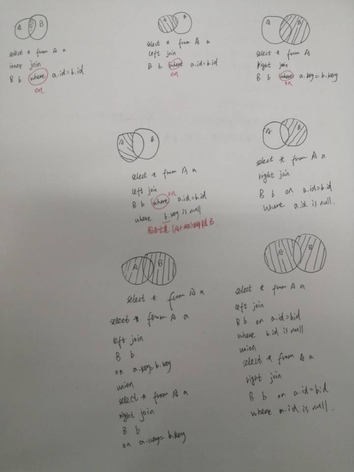

### 存储引擎

- 存储引擎是数据库底层的软件组织，数据库管理系统通过存储引擎进行增删查改。存储引擎主要有`InnoDB`、`MyISam`、`Memory`、`Archive`等。

- `mysql5.5`之前默认使用`MyISam`为默认存储引擎，`5.7`开始采用`InnoDB`为默认存储引擎。   

  查看mysql提供的所有存储引擎：`show engines;`  
  查看默认存储引擎：`show variables like '%storage_engine%';`  
  查看具体某个表的存储引擎：`show table status like "table_name";`  

- `InnoDB`与`MyISam`不同之处：

  1. **锁**：`InnoDB`支持行级锁和表级索，默认行级锁；`MyISam`只支持表级锁。
  2. **事务、崩溃后恢复**：`MyISam`查询具有原子性，速度比`InnoDB`快，但不支持事务；`InnoDb`提供事务支持事务，具有事务、回滚和崩溃修复能力。
  3. **是否支持外键**：`MyISAM`不支持，而`InnoDB`支持。
  4. **主键**：`InnoDB`表必须有主键，而`Myisam`可以没有。
  5. **缓存**：`MyISAM`只缓存索引，不缓存真实数据，`InnoDB`缓存索引和真实数据。
  6. **MVCC**：即多版本并发控制，`InnoDB`支持，`MyISam`不支持。
### 索引

- 索引是排好序的快速查找的数据结构。一般来说索引本身也很大，不可能全部存储在内存中，因此索引往往以文件形式存储在硬盘上。索引是在存储引擎层实现的，而不是在服务器层实现的，所以不同存储引擎具有不同的索引类型和实现。

- 优缺点：
  - 降低数据库IO成本；降低CPU消耗。
  - 提高查询速度，但降低了增删改的速度；索引自身是保存了主键和索引列字段的表，也需要占空间。

- 分类：

  - 单值索引：即一个索引只包含单个列，一个表可以有多个单列索引。
  - 复合索引/联合索引：即一个索引包含多个列。
  - 唯一索引：索引列的值必须唯一，但允许有空值。
  - 覆盖索引：索引列包含了查询的字段。(即`select `后面的字段都已建立索引)
  - **聚簇(集)索引**：数据行的物理顺序与主键那一列列值的逻辑顺序一致，并且叶节点就是数据结点。一张表只能有一个聚簇索引。`InnoDB`会默认自动创建聚簇索引
  - **非聚簇(集)索引/二级索引**：叶节点记录列值(普通列)和主键，如果想查询完整用户记录就需要根据主键值去聚簇索引中再查找一遍完整用户记录。这个过程称为回表，一张表能有多个非聚簇索引。
  
 #### B-Tree、B+Tree

  - 平衡二叉树缺点：
    - 如果节点很多的话，那么这个AVL树的高度还是会很高的，那么查询效率还是会很低。
    
    - 查询的效率不稳定，还是会有看运气的成分在里面。
    
    - 维护平衡过程的成本代价很高。因为每次删除一个节点或者增加一个节点的话，需要一次或者多次的左旋，右旋等去维护“平衡”状态。
    
    - 节点存储的数据内容太少。没有很好利用操作系统和磁盘数据交换特性，也没有利用好磁盘IO的预读能力。
    
- 2-3树
  - 2-3树是一种多路查找树，2和3的意思是2-3树包含两种结点：
    - 2结点包含一个元素和两个孩子(或者没有孩子)。左子树的结点的元素值小于该结点的元素值；右子树的结点的元素值大于该结点的元素值。
    - 3结点包含一大一小两个元素和三个孩子(或者没有孩子)。左子树的结点的元素值小于该结点较小的元素值；右子树的结点的元素值大于该结点较大的元素值。
    - 2-3树的所有叶子结点都在同一层次上。
    
  
  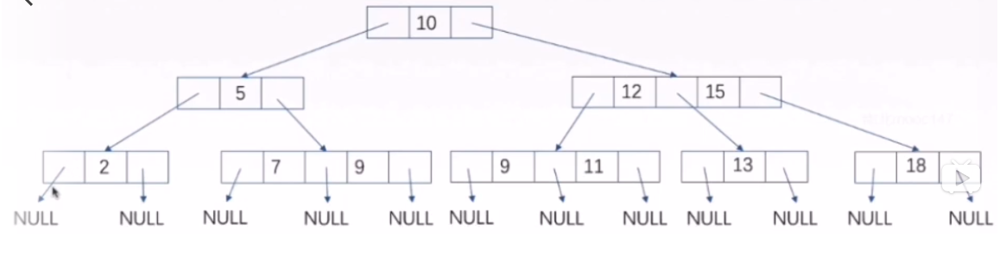
  
- 2-3树类推

  

- B树
  - B树也是一种平衡的多路查找树，2-3树和2-3-4树都是B树的特例。树中结点的最大孩子数为树的阶，通常记为m，2-3树的阶为3,2-3-4树的阶为4。
    - 树中每个结点至多有m颗子树。(即至多含m-1个关键字，两棵子树指针夹着一个关键字)。
    - 若根结点不是终端结点，则至少有两个子树。(至少一个关键字)
    - 除根节点外的所有非叶结点至少有[m/2]棵子树。(至少有[m/2]-1个关键字，[m/2]表示m/2向上取整)
    - 所有叶子结点出现在同一层次上。

- **B树与B+树区别**

  1. **B+树中，n个关键字的结点，含有n棵子树，即每个关键字对应一个子树；
     B树中，n个关键字的结点，含有n+1棵子树，两棵子树指针夹着一个关键字。**
  2. **B+树中，叶结点包含信息，所有非叶结点仅起到索引作用，非叶结点中的每个索引项只包含对应子树的最大关键字和指向该子树的指针，不含有该关键字对应记录的存储地址；
     B树中，每个关键字对应一个记录的存储地址。**
  3. **B+树中，叶结点包含了全部关键字，即非叶结点中出现的关键字也会出现在非叶结点中，而且叶子结点的指针指向记录；
     B树中，叶子结点包含的关键字和其他结点包含的关键字是不重复的。**
  4. **B+树中，有一个指针指向关键字最小的叶子结点，所有叶子结点连接成一个单链表。**
  5. B +树中，每个非根内部结点关键字个数n取值范围：[m/2] <= n <= m;
     B树中，每个非根内部结点关键字个数为 [m/2] -1  <= n <= m-1

  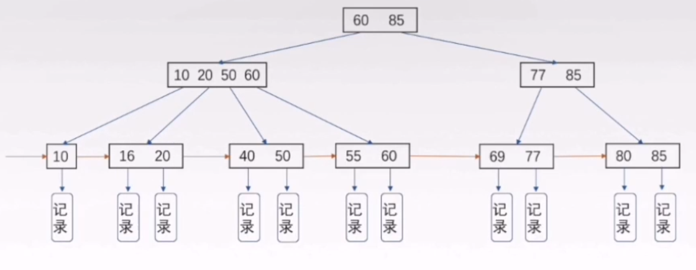

- **B+树相对B树的优势**
  - **查询操作消耗的时间取决于磁盘IO的次数，而B树的结点包含指针和数据，B+树的结点只包含指针，所以B+树看起来更“矮胖”，同一磁盘页可容纳更多的B+树结点，IO次数就更少。**
  - **B树中进行查询，只要找到匹配元素就行，无论是中间结点还是叶子结点；B+树中进行查询必须查到最终的叶子结点才行，所以B+树更稳定。**
  - **进行范围查询时，B树要中序遍历，而B+树使用链表指针即可，更加方便。**

- 索引`SQL`

  `create [unique] index [indexname] on table [tablename](column1,column2);`  

  `alter table [tablename] add [unique] index [indexname] on (column1,column2);`  

  `drop index [indexname] on [tablename];`  

  `show index from [tablename];`    

### `explain`查询分析

  - `explain + sql`可以查看`SQL`的执行计划。

    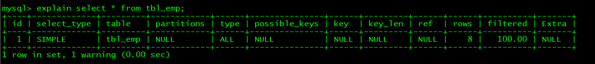
    
  - **`id`**：查询的序列号，包含一组数字。`id`越大，优先级越高，`id`相同时，执行顺序从上到下。`id`为`null`，则表示不需要查询。 
    
  - `select_type`：主要用于区别普通查询、联合查询、子查询等复杂查询。

  - `table`：从哪个表里查。

  - **`type`**：表示访问类型。

    1. `system`：表中只有一行记录。(一般不会出现)
    2. `const`：通过索引一次就找到了。
    3. `eq_ref`：对于每个索引键，表中只有一条记录与之匹配，常见于主键或唯一索引扫描。
    4. `ref`：返回匹配某个单独值的所有行，可能会找到多个符合条件的行。
    5. `range`：只检索给定范围的行，开始索引的某一点，而结束于另一点，不用扫描全部索引。
    6. `index`：读全表，从索引中读。
    7. `all`：读全表，从硬盘中读。

  - `possible_keys`：显示可能应用在这张表中的索引,一个或多个。

  - **key**：实际使用的索引。如果为`null`则没有使用索引。

  - `key_len`：索引最大可能长度，并非实际使用长度。

- `ref`：显示索引那一列被使用了，如果可能的话，是一个常数。那些列或常量被用于查找索引列上的值。

- **rows**：估算查询所需记录需要读取的行。

- **extra**：包含不适合在其他列中显示但十分重要的额外信息。

  1. `using filesort`：`mysql`会对数据使用一个外部的索引排序，而不是按照表内的索引顺序进行读取。
  2. `using temporary`：使用了临时表保存中间结果。
  3. `using index`：表示相应的`select`操作中使用了覆盖索引。

- 索引分析
    两表：左连接时，左表一定全都有，所以要在右表建立索引；右连接同理。
    多表：用小结果集驱动大结果集。优先优化内层循环。

### 索引失效

> 全值匹配我最爱，最左前缀要遵循；

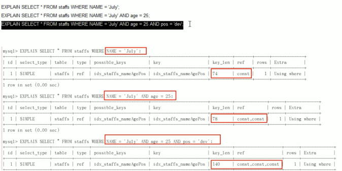

> 带头大哥不能死，中间兄弟不能断；

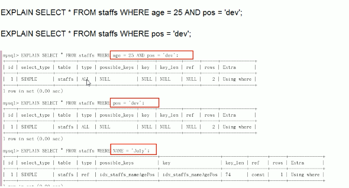

> 索引列上少计算，

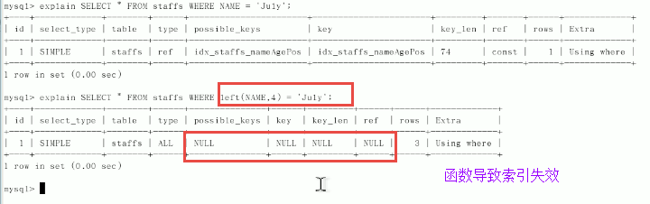

> 范围之后全失效；

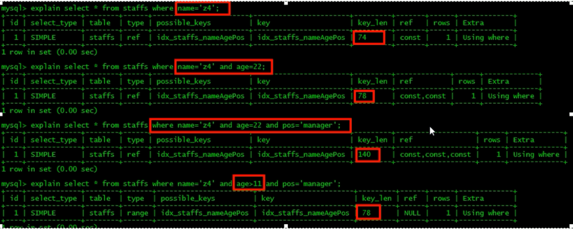

> like百分写最右，(如果确实要用 %July% ，可以用覆盖索引，查询字段必须是建立了索引的字段)

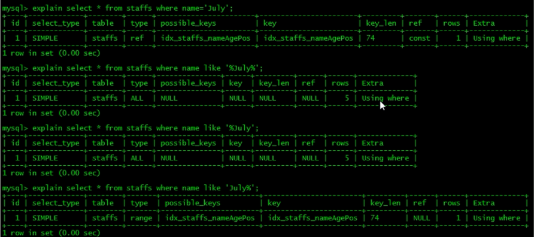

> 覆盖索引不写星；

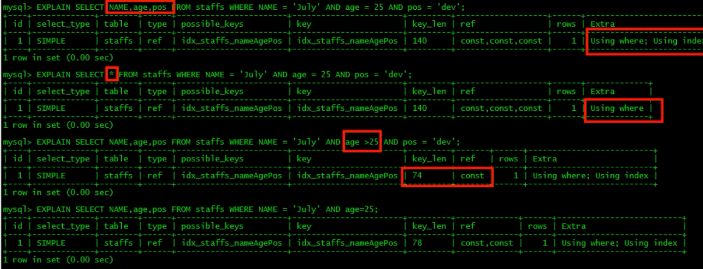

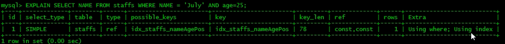

> 不等空值还有or，索引失效要少用；

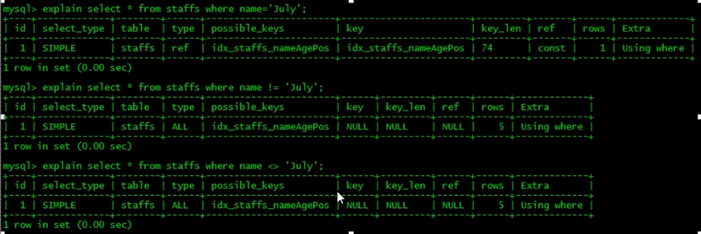

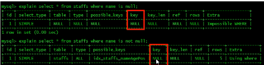

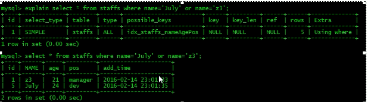

> var引号不能丢，SQL高级也不难。
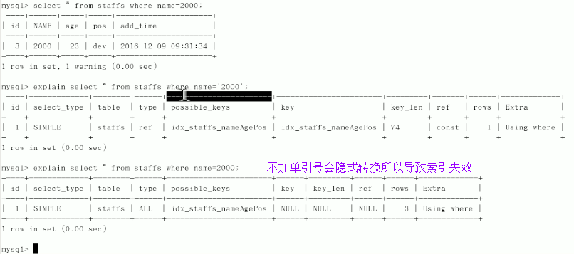

- 总结案例一

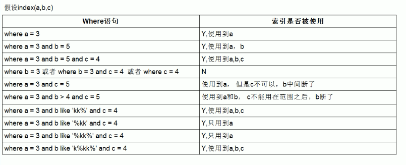

- 总结案例二

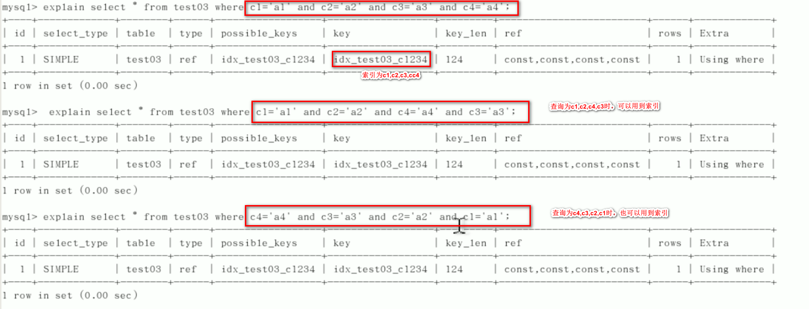

- 总结案例三

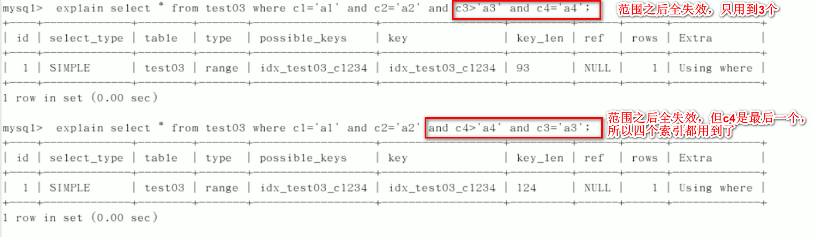

- 总结案例四

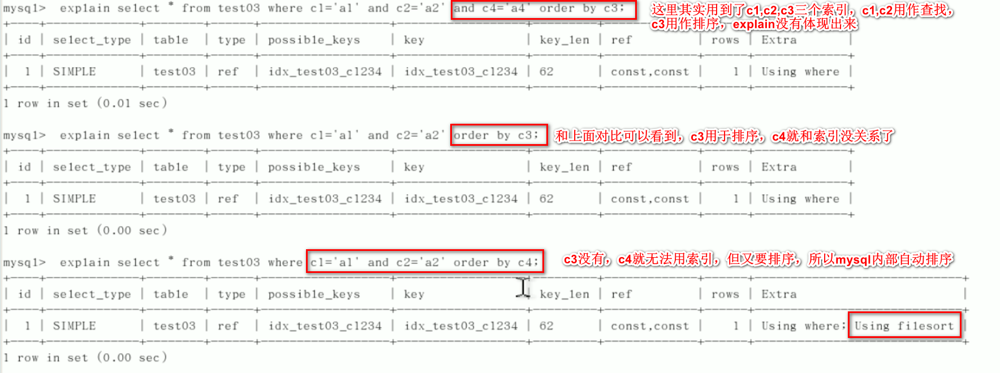 

- 总结案例五

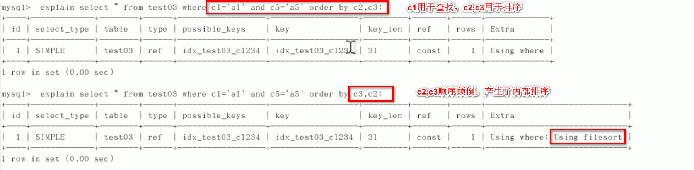

- 总结案例六

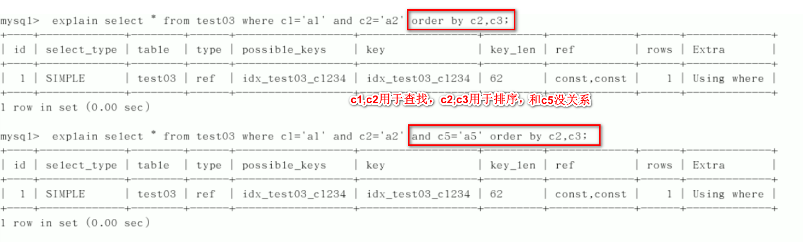

- 总结案例七

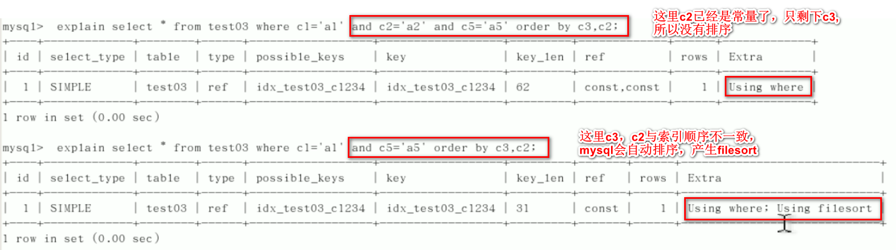

- 总结案例八

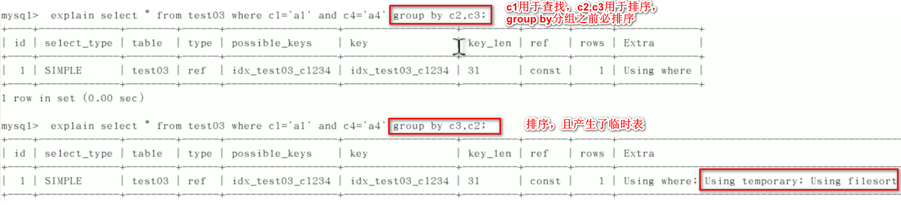

### 查询截取分析

#### 查询优化

1. 慢查询的开启与捕获
2. explain + 慢SQL分析
3. show profile查看sql的执行细节和生命周期
4. 数据库服务器参数调优

##### 小表驱动大表

- 两种方式对比

```java
// 相当于内外建立5次连接，每次连接查询1000次
for(int i = 0;i < 5;i ++){
    for(int j = 0;j < 1000; j ++){
        ...
    }
}
```

```java
// 相当于内外建立1000次连接，每次连接查询5次
for(int i = 0;i < 1000;i ++){
    for(int j = 0;j < 5; j ++){
        ...
    }
}
```

##### `exists`与` in`

- `in`

```sql
	select * from A where id in (select id from B);
	相当于
	select id from B
	select * from A where A.id = B.id;	
```
> `B`为外层循环，`A`为内层循环，所以，`B < A`时，用` in`。

- `exist`
```sql
  	select * from A where exists (select 1 from B where B.id = A.id);  
  	相当于
 	select * from A
	select * from B where B.id = A.id
```
> `A`为外层循环，`B`为内层循环，索引`A < B`时，用`exist`。

##### `exist`
- `select  ... from table where exitst (subquery);`可理解为：将主查询的数据，放到子查询中做条件验证，根据验证结果(true或者false)来决定主查询数据结果是否保留。
##### select 1/count()

```sql
-- select 1只是为了测试表中是否有数据，而不关心数据是什么。表中有多少行记录就返回多少行1,1也可以换成其
-- 它常量，比如2,'X'等等。
select 1 from student
-- exists(subquery)只返回true或者false;
-- 效率对比：count(*)=count(1)>count(primary key)>count(column)
-- count(expr)表示对expr不为null的结果集进行计数。1为恒真表达式;count(列)时，会先判断列是否为null。
```

##### order by

- `mysql`支持`filesort`和`index`两种排序方式。`filesort`效率低，`index`效率高。`oder by`字句满足 ”最左前缀要遵循，带头大哥不能死，中间兄弟不能断“ 时，会使用`index`排序。

- 如果不在索引列上，会用`filesort`排序，`filesort`排序的两种算法：
  
  - 双路排序：`MySQL4.1`之前是使用双路排序，读取行指针和`orderby`列，对他们进行排序，然后扫描已经排序好的列表，按照列表中的值重新从列表中读取对应的数据传输。会两次扫描磁盘。
  - 单路排序：从磁盘读取查询需要的所有列，按照`orderby`列在`buffer`中对它们进行排序，然后扫描排序后的列表进行输出。只需一次`IO`,因为它把每一行都保存在内存中了。
  
  - 问题：单路比双路要多占很多空间，因为它是一次性把所有数据都取出来，倘若取出的数据过多，超过了`sort_buffer`容量，那每次只能取一部分排序，排完序再取再排....会生成临时文件且导致多次`IO`，效果可能不如双路。
  
  - 解决方案：
  
  1. `order by `时不要用`select *`，因为如果字段很多，可能会占满`sort_buffer`和`max_length_for_sort_data`。导致产生临时文件和多次`IO`，效率低。
  2. 尝试增大`sort_buffer`
  3. 尝试增大`max_length_for_sort_data`
  
- 案例分析一

 

- 案例分析二

 

- 案例分析三

  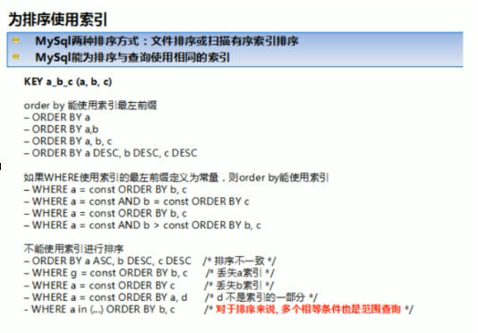

##### group by

- `where`高于`having`，能在`where`里限定的条件就不要去`having`里限定。其他与`order by`相同。

#### 慢查询日志

  - `mysql`的慢查询日志是用来**记录响应时间大于(不是大于等于)`long_query_time`的`SQL`语句**。默认关闭，如果不是调优，不建议开。


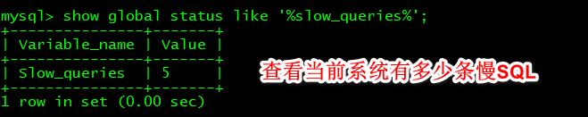

  ##### 日志分析工具`mysqlDumpSlow`

- `mysqldumpslow`可用来分析慢查询日志文件

  

- 参数

  show profile

#### `show profile`查看`sql`执行的资源消耗情况

- `show profile`可用来分析当前会话中语句执行的资源消耗情况，可用于`sqk`调优测量。默认关闭。

  

- 开启后，运行`show profiles`查看最近运行的`sql`语句及分别的运行时间，包含多个`sql`的运行情况，第一列为`Query_ID`。

- 运行`show profile + 参数 +for query + Query_ID `查看具体的运行信息。


- 当Status中出现如下值时要注意：

  1. `converting HEAP to MyISAM`：查询结果太大，内存不够用，往磁盘上搬了。

  2. `Creating tmp table`：创建了临时表。

  3. `Copying tmp table on disk`：把内存中临时表复制到磁盘。

  4. `locked`

- 参数列表：

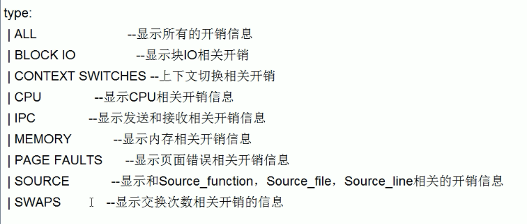

#### 全局查询日志

- 一般不
