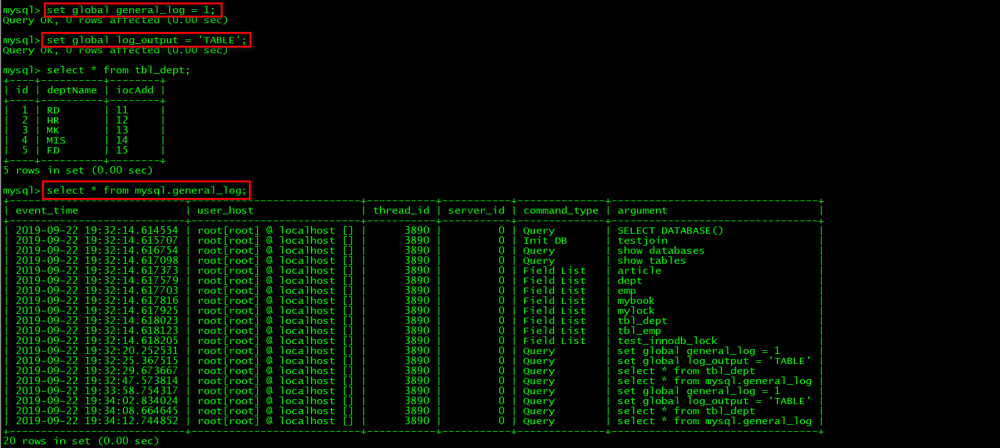
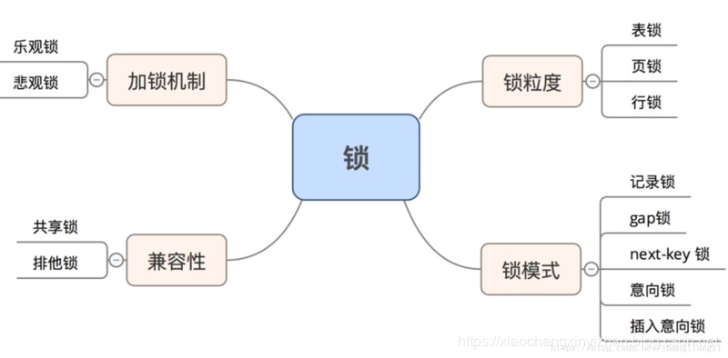

* [事物](#%E4%BA%8B%E7%89%A9)
  * [MVCC](#mvcc)
* [数据库三大范式](#%E6%95%B0%E6%8D%AE%E5%BA%93%E4%B8%89%E5%A4%A7%E8%8C%83%E5%BC%8F)
  * [优点](#%E4%BC%98%E7%82%B9)
  * [缺点](#%E7%BC%BA%E7%82%B9)
* [delete、truncate、drop区别](#deletetruncatedrop%E5%8C%BA%E5%88%AB)
* [join](#join)
* [存储引擎](#%E5%AD%98%E5%82%A8%E5%BC%95%E6%93%8E)
* [索引](#%E7%B4%A2%E5%BC%95)
  * [Change\_Buffer](#change_buffer)
* [WAL(write ahead logging)](#walwrite-ahead-logging)
* [Change\_Buffer VS redo log](#change_buffer-vs-redo-log)
  * [索引下推（ICP）](#%E7%B4%A2%E5%BC%95%E4%B8%8B%E6%8E%A8icp)
  * [什么时候建索引](#%E4%BB%80%E4%B9%88%E6%97%B6%E5%80%99%E5%BB%BA%E7%B4%A2%E5%BC%95)
  * [什么时候不建索引](#%E4%BB%80%E4%B9%88%E6%97%B6%E5%80%99%E4%B8%8D%E5%BB%BA%E7%B4%A2%E5%BC%95)
  * [为什么推荐主键自增](#%E4%B8%BA%E4%BB%80%E4%B9%88%E6%8E%A8%E8%8D%90%E4%B8%BB%E9%94%AE%E8%87%AA%E5%A2%9E)
  * [B\-Tree、B\+Tree](#b-treebtree)
* [explain查询分析](#explain%E6%9F%A5%E8%AF%A2%E5%88%86%E6%9E%90)
* [索引失效](#%E7%B4%A2%E5%BC%95%E5%A4%B1%E6%95%88)
* [查询截取分析](#%E6%9F%A5%E8%AF%A2%E6%88%AA%E5%8F%96%E5%88%86%E6%9E%90)
  * [查询优化](#%E6%9F%A5%E8%AF%A2%E4%BC%98%E5%8C%96)
    * [小表驱动大表](#%E5%B0%8F%E8%A1%A8%E9%A9%B1%E5%8A%A8%E5%A4%A7%E8%A1%A8)
    * [exists与 in](#exists%E4%B8%8E-in)
    * [exist](#exist)
    * [select 1/count()](#select-1count)
    * [order by](#order-by)
    * [group by](#group-by)
  * [慢查询日志](#%E6%85%A2%E6%9F%A5%E8%AF%A2%E6%97%A5%E5%BF%97)
    * [日志分析工具mysqlDumpSlow](#%E6%97%A5%E5%BF%97%E5%88%86%E6%9E%90%E5%B7%A5%E5%85%B7mysqldumpslow)
  * [show profile查看sql执行的资源消耗情况](#show-profile%E6%9F%A5%E7%9C%8Bsql%E6%89%A7%E8%A1%8C%E7%9A%84%E8%B5%84%E6%BA%90%E6%B6%88%E8%80%97%E6%83%85%E5%86%B5)
  * [全局查询日志](#%E5%85%A8%E5%B1%80%E6%9F%A5%E8%AF%A2%E6%97%A5%E5%BF%97)
* [锁](#%E9%94%81)
  * [全局锁](#%E5%85%A8%E5%B1%80%E9%94%81)
  * [Metadata lock](#metadata-lock)
  * [表锁](#%E8%A1%A8%E9%94%81)
    * [读锁](#%E8%AF%BB%E9%94%81)
    * [写锁](#%E5%86%99%E9%94%81)
    * [读写锁总结](#%E8%AF%BB%E5%86%99%E9%94%81%E6%80%BB%E7%BB%93)
    * [表锁定分析](#%E8%A1%A8%E9%94%81%E5%AE%9A%E5%88%86%E6%9E%90)
  * [行锁](#%E8%A1%8C%E9%94%81)
    * [行锁演示](#%E8%A1%8C%E9%94%81%E6%BC%94%E7%A4%BA)
    * [无索引行锁升级为表锁](#%E6%97%A0%E7%B4%A2%E5%BC%95%E8%A1%8C%E9%94%81%E5%8D%87%E7%BA%A7%E4%B8%BA%E8%A1%A8%E9%94%81)
    * [间隙锁](#%E9%97%B4%E9%9A%99%E9%94%81)
    * [行锁定分析](#%E8%A1%8C%E9%94%81%E5%AE%9A%E5%88%86%E6%9E%90)
* [主从复制](#%E4%B8%BB%E4%BB%8E%E5%A4%8D%E5%88%B6)
* [切分](#%E5%88%87%E5%88%86)
  * [水平切分](#%E6%B0%B4%E5%B9%B3%E5%88%87%E5%88%86)
  * [垂直切分](#%E5%9E%82%E7%9B%B4%E5%88%87%E5%88%86)

### 事物

- 事务是逻辑上的一组操作，要么都执行，要么都不执行。
- 四个特性：
  
  - **原子性**： 事务是最小的执行单位，不允许分割。
  
  - **一致性**：数据库的完整性约束没有被破坏，事务执行的前后都是合法的数据状态。
  
  - **隔离性**：并发访问数据库时，一个用户的事务不被其他事务所干扰。
  - **持久性**： 一个事务被提交之后。它对数据库中数据的改变是持久的。
- `redo`日志
  - `redo`日志会把事务在执行过程中对数据库所做的所有修改都记录下来，在之后系统崩溃重启后可以把事务所做的任何修改都恢复出来。实现持久性。
  - `InnoDB`存储引擎是以页为单位来管理存储空间的，页大小默认`16K`，在真正访问页之前，需要先把在磁盘上的页缓存到内存的`Buffer Pool`中。同样事务对数据库的操作也是操作的`Buffer Pool`，如果在事务提交后突然发生了某个故障，导致内存中的数据都失效了，那么这个已经提交了的事务对数据库中所做的更改也就跟着丢失了。但我们希望让已经提交了的事务对数据库中数据所做的修改永久生效，即使后来系统崩溃，在重启后也能把这种修改恢复出来。
- `undo` 日志
- `undo`日志就是为了回滚而记录的文件，实现原子性。
  - 如果事务执行时遇到错误，比如突然断电，或者执行了`Rollback`语句时导致事务执行到一半就结束，但是事务执行过程中可能已经修改了很多东西，为了保证事务的原子性，我们需要把数据改回原先的样子。
- 并发事物带来的问题：

  - **丢失更新**：最后的更新覆盖了其他事务已经提交的更新。
  - **脏写**：事务`A`修改了事务`B`已修改但尚未提交的数据。
  - **脏读**：事务`A`读到了事务`B`已修改但尚未提交的数据。
  - **不可重复读**：事务A读到了事务B已经提交的**修改**数据。
  - **幻读(虚读)**：事务A读到了事务B已经提交的**新增**数据。
- 隔离级别
  - **READ-UNCOMMITTED(读未提交)**：允许读取尚未提交的数据变更。可能发生脏读、不可重复读、幻读
  - **READ-COMMITTED(读已提交)**：允许读取并发事务已经提交的数据。可能发生不可重复读和幻读问题，不会发生脏读
  - **REPEATABLE-READ(可重复读)**：`mysql`默认级别， 对同一字段的多次读取结果都是一致的。可能发生幻读问题，不会发生脏读和不可重复读
  - **SERIALIZABLE(可串行化)：** 最高的隔离级别，所有的事务依次逐个执行，这样事务之间就完全不可能产生干扰。各种问题都不可以发生。
  - 查看当前数据库隔离级别：`show variables like 'tx_isolation';`
  
#### `MVCC`

  - `mvcc`指在读已提交和可重复读两个隔离级别下，通过控制查询时访问记录的方式使不同事务的`读-写`、`写-读`操作并发执行，从而提升系统性能。
  - 读未提交级别可以读到未提交事务修改的记录，直接读最新版本记录即可，可串行化级别下所有事务依次执行。所以这两个级别不需要`MVCC`。
  - 在`InnoDB`中，`InnoDB`向数据库的每一行添加三个隐藏字段：
  
    - 6字节的`DB_TRX_ID`：事务`id`。标识最近一次对本行记录做修改的事务的id
    - 7字节的`DB_ROLL_PTR`：回滚指针。指向当前记录项的`undo`日志。即当前记录修改前的信息。
    - 6字节的`DB_ROW_ID`(可选)：行`id`，唯一标识一条记录。`Innodb`主键生成策略：优先使用用户定义主键作为主键，如果没有定义，则选取一个`Unique`键作为主键，如果`Unique`键都没有定义的话，则会为表默认添加一个名为`row_id`的隐藏列作为主键。在没有自定义主键以及`Unique`键的情况下才会添加该列。
- 每条记录每次更新后，都会将旧值放到一条`undo`日志中，作为该记录的一个旧版本，随着更新次数的增多，所有的版本都会被`roll_pointer`属性连接成一个链表，这个链表称为`版本链`，版本链的头节点就是当前记录最新的值。另外，每个版本中还包含生成该版本对应的`事务id`。
- 对于读已提交、可重复读两个级别都必须保证读到已经提交了的事务修改过的记录。也就是说假如`A`事务已经修改了记录但尚未提交，`B`事务是不能直接读取的。为此，引入`ReadView`，`ReadView`有4个重要内容

  - `m_ids`：在生成`ReadView`时当前系统中**活跃的事务`id`列表**。
  - `min_trx_id`：在生成`ReadView`时当前系统中**最小的活跃事务`id`**，也就是`m_ids`中的最小值。
  - `max_trx_id`：表示生成`ReadView`时系统中应该分配给**下一个事务的`id`值(未开启的事务)**，即当前最大事务`id + 1`。(事务`id`是递增分配的)
  - `creator_trx_id`：表示生成该`ReadView`的事务的`事务id`，即**当前事务`id`**。
- 可见性比较算法：
  - 有了这个`ReadView`，这样在访问某条记录时，只需要按照下边的步骤判断记录的某个版本是否可见：
    - **如果被访问的记录的`trx_id`小于`min_trx_id`，表明该记录的事务已经提交，所以可以被当前事务访问。**
    - **如果被访问的记录的`trx_id`大于或等于`max_trx_id`，表明该记录的事务在当前事务生成`ReadView`后才开启，所以不能被当前事务访问。**
    - **如果被访问的记录的`trx_id`在`min_trx_id`和`max_trx_id`之间，那就需要判断`trx_id`值在不在`m_ids`列表中，如果在，说明该记录的事务还是活跃的，该版本不可以被访问；如果不在，说明该记录的事务已经被提交，该版本可以被访问。**
    - **如果某个版本的记录对当前事务不可见，就顺着版本链找到下一个版本的记录，继续按照上边的步骤判断可见性，依此类推，直到版本链中的最后一个版本。如果最后一个版本也不可见，那么就意味着该条记录对该事务完全不可见，查询结果就不包含该记录。**
- 在`MySQL`中，读已提交和可重复读两个级别的的一个非常大的区别就是它们生成`ReadView`的时机不同。读已提交在每次读取数据前都生成一个`ReadView`，可重复读在第一次读取数据时生成一个`ReadView`。
- 通过生成一个`ReadView`，然后通过`ReadView`找到符合条件的记录版本（历史版本是由`undo`日志构建的），其实就像是在生成`ReadView`的那个时刻做了一次时间静止（就像用相机拍了一个快照），查询语句只能读到在生成`ReadView`之前已提交事务所做的更改，在生成`ReadView`之前未提交的事务或者之后才开启的事务所做的更改是看不到的。
- 事务利用`MVCC`进行的读取操作称之为`一致性读`，或者`一致性无锁读`，有的地方也称之为`快照读`。`一致性读`并不会对表中的任何记录做`加锁`操作，其他事务可以自由的对表中的记录做改动。

### 快照读 VS 当前读

- 快照读，也叫`一致性读`，或者`一致性无锁读`，读取的是记录的可见版本 (有可能是历史版本)，不用加锁。
  - `select * from table where ?;`
- 当前读，读取的是记录的最新版本，并且，当前读返回的记录，都会加上锁，保证其他事务不会再并发修改这条记录。
  - `select * from table where ? lock in share mode;`
  - `select * from table where ? for update;`
  - `insert into table values (…);`
  - `update table set ? where ?;`
  - `delete from table where ?;`

### 数据库三大范式

1. **列都是不可再分的**。强调列的原子性

2. 基于第一范式，表必须有主键，**非主键列必须完全依赖于主键，而不能只依赖于主键的一部分**。其实就是消除部分依赖

3. **不存在对非主键列的传递依赖**。即不能字段A---->完全依赖于主键，但是字段B---->又完全依赖字段A，其实字段B和主键并没有太大关系

   - 比如`Student`表（学号，姓名，年龄，性别，所在院校，院校地址，院校电话）

   应该拆分成

   - （学号，姓名，年龄，性别，所在院校）--（所在院校，院校地址，院校电话）

#### 优点

- 数据冗余小，查询更快
- 表更小，可以在内存中执行

#### 缺点

- 稍微复杂点的查询就可能需要多次关联查询

### `delete`、`truncate`、`drop`区别

1. `delete`语句为`DML`，要`commit`，可以回滚。
2. `truncate`、`drop`是`DLL`，隐式提交，不能回滚。
3. `delete`可以删除某一行数据，也可以删除全表数据，也可以删除视图。
4. `truncate`删除全表数据，
5. `drop`删除表(包括表结构和数据)，释放表所占空间。

### join


### 存储引擎

- 存储引擎是数据库底层的软件组织，数据库管理系统通过存储引擎进行增删查改。存储引擎主要有`InnoDB`、`MyISam`、`Memory`、`Archive`等。

- `mysql5.5`之前默认使用`MyISam`为默认存储引擎，`5.7`开始采用`InnoDB`为默认存储引擎。   

  查看mysql提供的所有存储引擎：`show engines;`  
  查看默认存储引擎：`show variables like '%storage_engine%';`  
  查看具体某个表的存储引擎：`show table status like "table_name";`  

- `InnoDB`与`MyISam`不同之处：

  1. **锁**：`InnoDB`支持行级锁和表级索，默认行级锁；`MyISam`只支持表级锁。
  2. **事务、崩溃后恢复**：`MyISam`查询具有原子性，速度比`InnoDB`快，但不支持事务；`InnoDb`提供事务支持事务，具有事务、回滚和崩溃修复能力。
  3. **是否支持外键**：`MyISAM`不支持，而`InnoDB`支持。
  4. **主键**：`InnoDB`表必须有主键，而`Myisam`可以没有。
  5. **缓存**：`MyISAM`只缓存索引，不缓存真实数据，`InnoDB`缓存索引和真实数据。
  6. **MVCC**：即多版本并发控制，`InnoDB`支持，`MyISam`不支持。
### 索引

- 索引是排好序的快速查找的数据结构。一般来说索引本身也很大，不可能全部存储在内存中，因此索引往往以文件形式存储在硬盘上。索引是在存储引擎层实现的，而不是在服务器层实现的，所以不同存储引擎具有不同的索引类型和实现。

- 优缺点：
  - 降低数据库IO成本；降低CPU消耗。
  - 提高查询速度，但降低了增删改的速度；索引自身是保存了主键和索引列字段的表，也需要占空间。

- 分类：

  - 单值索引：即一个索引只包含单个列，一个表可以有多个单列索引。
  - 复合索引/联合索引：即一个索引包含多个列。
  - 唯一索引：索引列的值必须唯一，但允许有空值。
  - 主键索引：索引列的值必须唯一，且不为空
  - 覆盖索引：索引列包含了查询的字段。(即`select `后面的字段都已建立索引)
    - **覆盖索引：当我们走辅助索引能获取到我们所需要的数据而不需要再次进行回表操作**。
  - 组合索引：用多个列组合构建的索引，这多个列中的值不允许有空值
  - **聚簇(集)索引**：**以主键作为B+树索引的键值而构建的B+树索引，叶节点就是数据结点。一张表只能有一个聚簇索引。`InnoDB`会默认自动创建聚簇索引**
  - **非聚簇(集)索引/二级索引/辅助索引**：**主键以外的列值作为键值构建的B+树索引，它的叶子节点不存储表中的数据，而是存储该列对应的主键，如果想查询完整用户记录就需要根据主键值去聚簇索引中再查找一遍完整用户记录。这个过程称为回表，一张表能有多个非聚簇索引。**
  - 稀疏索引：部分索引键值对应一个索引项。节约空间，查询速度比稠密索引慢
  - 稠密索引：每个索引键值都对应一个索引项。比稀疏索引更快的定位到一条记录，但占用空间更大
  
#### Change_Buffer

- change_buffer可以持久化，会存到redo log中

- 更新一个数据页的时候，如果数据页在缓存中就直接更新，如果不在，在不影响数据一致性的前提下，innodb会把更新操作缓存到change_buffer中，就不需要从磁盘中读入数据页了。
- 下次查询需要访问这个数据页时，将数据页读入内存，将change_buffer中的操作应用到数据页中，得到最新结果。这个过程叫做**merge**。系统后台也会有线程定期merge。
- 好处：减少读磁盘，语句执行速度会提升
- **只适合普通索引，不适合唯一索引**。唯一索引要把数据页读入内存中来判断插入的记录是否唯一，已经读到内存中了，就不需要用change_buffer中了
- 使用场景：写多读少。(如果读多，将更新操作记录到change_buffer中，立马又要merge，反而增加维护change_buffer的代价)

### WAL(write ahead logging)

- 关键点：先写日志，再写磁盘
- 当有记录要更新时，innodb会先把他写到redo log里，更新内存。然后在合适的时候在把这个操作记录到磁盘里。

### Change_Buffer VS redo log

- **redo log 主要节省的是随机写磁盘的IO消耗（转成顺序写），而change buffer主要节省的则是随机读磁盘的IO消耗。**
- change_buffer：只有真正读的时候，数据页才会被读入内存。

#### 索引下推（ICP）

- 5.6新增的查询优化，可用于InnoDB和MyISAM表，针对二级索引(相对于Innodb)

- `set optimizer_switch='index_condition_pushdown=on';`，默认开启

- 使用了索引下推，explain分析sql时Extra会显示**Using index condition**。并不是Using index

- 由存储引擎将索引中的数据与条件进行判断，直接过滤掉不满足条件的记录，**减少回表次数**。比如建立索引(name，age)，sql语句为`select * from tuser where name like '张 %' and age=10`，如果不同索引下推，只能匹配到姓为张的，然后逐个做回表操作，如果用了索引下推，对于age不为10的记录就会过滤，减少回表次数。


#### 什么时候建索引

- 频繁作为查询条件的字段
- 多表关联查询时，作为关联字段应该建索引
- 查询中的排序字段
- 统计或分组的字段

#### 什么时候不建索引

- 表记录少
- 经常增删改
- 字段很大
- where条件使用不高的字段

#### 为什么推荐主键自增

- 主键自增，每次插入的主键都会比前面的大，构建B+树是直接在右边加就行，不需要进行移动其他结点的位置，如果移动其他结点位置，还可能造成页分裂。
- 页分裂：移动的那部分结点需要放在一个新申请的数据页中。

 #### B-Tree、B+Tree

- 二叉树缺点
  - 二叉树存在极端情况，比如所以节点都只有右孩子。

  - 平衡二叉树缺点：
    - 如果节点很多的话，那么这个AVL树的高度还是会很高的，那么查询效率还是会很低。
    - 查询的效率不稳定，还是会有看运气的成分在里面。
    - 维护平衡过程的成本代价很高。因为每次删除一个节点或者增加一个节点的话，需要一次或者多次的左旋，右旋等去维护“平衡”状态。
    - 节点存储的数据内容太少。没有很好利用操作系统和磁盘数据交换特性，也没有利用好磁盘IO的预读能力。
  
- `HashMap`缺点

  - `hash`表只能匹配是否相等，无法实现范围查找
  - 当需要按照索引进行`order by`时，`hash`值无法支持排序
  - 数据量大时，`hash`冲突概率较大
  - 使用联合索引时，如果使用`hash`表，那么就会将多个字段合并成一个`key`，就不能支持部分索引了

- 2-3树
  
  - 2-3树是一种多路查找树，2和3的意思是2-3树包含两种结点：
    - 2结点包含一个元素和两个孩子(或者没有孩子)。左子树的结点的元素值小于该结点的元素值；右子树的结点的元素值大于该结点的元素值。
    - 3结点包含一大一小两个元素和三个孩子(或者没有孩子)。左子树的结点的元素值小于该结点较小的元素值；右子树的结点的元素值大于该结点较大的元素值。
    - 2-3树的所有叶子结点都在同一层次上。
    
  
  
  
- 2-3树类推

  

- B树
  - B树也是一种平衡的多路查找树，2-3树和2-3-4树都是B树的特例。树中结点的最大孩子数为树的阶，通常记为m，2-3树的阶为3,2-3-4树的阶为4。
    - 树中每个结点至多有m颗子树。(即至多含m-1个关键字，两棵子树指针夹着一个关键字)。
    - 若根结点不是终端结点，则至少有两个子树。(至少一个关键字)
    - 除根节点外的所有非叶结点至少有[m/2]棵子树。(至少有[m/2]-1个关键字，[m/2]表示m/2向上取整)
    - 所有叶子结点出现在同一层次上。

- **B树与B+树区别**

  1. **B+树中，n个关键字的结点，含有n棵子树，即每个关键字对应一个子树；
     B树中，n个关键字的结点，含有n+1棵子树，两棵子树指针夹着一个关键字。**
  2. **B+树中，叶结点包含信息，所有非叶结点仅起到索引作用，非叶结点中的每个索引项只包含对应子树的最大关键字和指向该子树的指针，不含有该关键字对应记录的存储地址；
     B树中，每个关键字对应一个记录的存储地址。**
  3. **B+树中，叶结点包含了全部关键字，即非叶结点中出现的关键字也会出现在非叶结点中，而且叶子结点的指针指向记录；
     B树中，叶子结点包含的关键字和其他结点包含的关键字是不重复的。**
  4. **B+树中，有一个指针指向关键字最小的叶子结点，所有叶子结点连接成一个单链表。**
  5. B +树中，每个非根内部结点关键字个数n取值范围：[m/2] <= n <= m;
     B树中，每个非根内部结点关键字个数为 [m/2] -1  <= n <= m-1

  

- **B+树相对B树的优势**
  - **查询操作消耗的时间取决于磁盘IO的次数，而B树的结点包含指针和数据，B+树的结点只包含指针，所以B+树看起来更“矮胖”，同一磁盘页可容纳更多的B+树结点，IO次数就更少。**
  - **B树中进行查询，只要找到匹配元素就行，无论是中间结点还是叶子结点；B+树中进行查询必须查到最终的叶子结点才行，所以B+树更稳定。**
  - **进行范围查询时，B树要中序遍历，而B+树使用链表指针即可，更加方便。**

- 索引`SQL`

  `create [unique] index [indexname] on table [tablename](column1,column2);`  

  `alter table [tablename] add [unique] index [indexname] on (column1,column2);`  

  `drop index [indexname] on [tablename];`  

  `show index from [tablename];`    

### `explain`查询分析

  - `explain + sql`可以查看`SQL`的执行计划。

    
    
  - **`id`**：查询的序列号，包含一组数字。`id`越大，优先级越高，`id`相同时，执行顺序从上到下。`id`为`null`，则表示不需要查询。 
    
  - `select_type`：主要用于区别普通查询、联合查询、子查询等复杂查询。

  - `table`：从哪个表里查。

  - **`type`**：表示访问类型。

    1. `system`：表中只有一行记录。(一般不会出现)
    2. `const`：通过索引一次就找到了。
    3. `eq_ref`：对于每个索引键，表中只有一条记录与之匹配，常见于主键或唯一索引扫描。
    4. `ref`：返回匹配某个单独值的所有行，可能会找到多个符合条件的行。
    5. `range`：只检索给定范围的行，开始索引的某一点，而结束于另一点，不用扫描全部索引。
    6. `index`：读全表，从索引中读。
    7. `all`：读全表，从硬盘中读。

  - `possible_keys`：显示可能应用在这张表中的索引,一个或多个。

  - **key**：实际使用的索引。如果为`null`则没有使用索引。

  - `key_len`：索引最大可能长度，并非实际使用长度。

- `ref`：显示索引那一列被使用了，如果可能的话，是一个常数。那些列或常量被用于查找索引列上的值。

- **rows**：估算查询所需记录需要读取的行。

- **extra**：包含不适合在其他列中显示但十分重要的额外信息。

  1. `using filesort`：`mysql`会对数据使用一个外部的索引排序，而不是按照表内的索引顺序进行读取。
  2. `using temporary`：使用了临时表保存中间结果。
  3. `using index`：表示相应的`select`操作中使用了覆盖索引。

- 索引分析
    两表：左连接时，左表一定全都有，所以要在右表建立索引；右连接同理。
    多表：用小结果集驱动大结果集。优先优化内层循环。

### 索引失效

> 全值匹配我最爱，最左前缀要遵循；


> 带头大哥不能死，中间兄弟不能断；


> 索引列上少计算，


> 范围之后全失效；


> like百分写最右，(如果确实要用 %July% ，可以用覆盖索引，查询字段必须是建立了索引的字段)


> 覆盖索引不写星；


> 不等空值还有or，索引失效要少用；


> var引号不能丢，SQL高级也不难。


- 总结案例一


- 总结案例二


- 总结案例三


- 总结案例四

 

- 总结案例五


- 总结案例六


- 总结案例七


- 总结案例八


### 查询截取分析

#### 查询优化

1. 慢查询的开启与捕获
2. explain + 慢SQL分析
3. show profile查看sql的执行细节和生命周期
4. 数据库服务器参数调优

##### 小表驱动大表

- 两种方式对比

```java
// 相当于内外建立5次连接，每次连接查询1000次
for(int i = 0;i < 5;i ++){
    for(int j = 0;j < 1000; j ++){
        ...
    }
}
```

```java
// 相当于内外建立1000次连接，每次连接查询5次
for(int i = 0;i < 1000;i ++){
    for(int j = 0;j < 5; j ++){
        ...
    }
}
```

##### `exists`与` in`

- `in`

```sql
	select * from A where id in (select id from B);
	相当于
	select id from B
	select * from A where A.id = B.id;
```
> `B`为外层循环，`A`为内层循环，所以，`B < A`时，用` in`。

- `exist`

```sql
  select * from A where exists (select 1 from B where B.id = A.id);
  相当于
  select * from A
  select * from B where B.id = A.id
```
> `A`为外层循环，`B`为内层循环，索引`A < B`时，用`exist`。

##### `exist`

- `select  ... from table where exitst (subquery);`可理解为：将主查询的数据，放到子查询中做条件验证，根据验证结果(true或者false)来决定主查询数据结果是否保留。

##### select 1/count()

```sql
-- select 1只是为了测试表中是否有数据，而不关心数据是什么。表中有多少行记录就返回多少行1,1也可以换成其
-- 它常量，比如2,'X'等等。
select 1 from student
-- exists(subquery)只返回true或者false;
-- 效率对比：count(*)=count(1)>count(primary key)>count(column)
-- count(expr)表示对expr不为null的结果集进行计数。1为恒真表达式;count(列)时，会先判断列是否为null。
```

##### order by

- `mysql`支持`filesort`和`index`两种排序方式。`filesort`效率低，`index`效率高。`oder by`字句满足 ”最左前缀要遵循，带头大哥不能死，中间兄弟不能断“ 时，会使用`index`排序。

- 如果不在索引列上，会用`filesort`排序，`filesort`排序的两种算法：
  
  - 双路排序：`MySQL4.1`之前是使用双路排序，读取行指针和`orderby`列，对他们进行排序，然后扫描已经排序好的列表，按照列表中的值重新从列表中读取对应的数据传输。会两次扫描磁盘。
  - 单路排序：从磁盘读取查询需要的所有列，按照`orderby`列在`buffer`中对它们进行排序，然后扫描排序后的列表进行输出。只需一次`IO`,因为它把每一行都保存在内存中了。
  
  - 问题：单路比双路要多占很多空间，因为它是一次性把所有数据都取出来，倘若取出的数据过多，超过了`sort_buffer`容量，那每次只能取一部分排序，排完序再取再排....会生成临时文件且导致多次`IO`，效果可能不如双路。
  
  - 解决方案：
  
  1. `order by `时不要用`select *`，因为如果字段很多，可能会占满`sort_buffer`和`max_length_for_sort_data`。导致产生临时文件和多次`IO`，效率低。
  2. 尝试增大`sort_buffer`
  3. 尝试增大`max_length_for_sort_data`
  
- 案例分析一


- 案例分析二


- 案例分析三


##### group by

- `where`高于`having`，能在`where`里限定的条件就不要去`having`里限定。其他与`order by`相同。

#### 慢查询日志

  - `mysql`的慢查询日志是用来**记录响应时间大于(不是大于等于)`long_query_time`的`SQL`语句**。默认关闭，如果不是调优，不建议开。

  

  

  

  ##### 日志分析工具`mysqlDumpSlow`

- `mysqldumpslow`可用来分析慢查询日志文件

  

- 参数

  show profile

#### `show profile`查看`sql`执行的资源消耗情况

- `show profile`可用来分析当前会话中语句执行的资源消耗情况，可用于`sqk`调优测量。默认关闭。

  

- 开启后，运行`show profiles`查看最近运行的`sql`语句及分别的运行时间，包含多个`sql`的运行情况，第一列为`Query_ID`。

- 运行`show profile + 参数 +for query + Query_ID `查看具体的运行信息。


- 当Status中出现如下值时要注意：

​	1. `converting HEAP to MyISAM`：查询结果太大，内存不够用，往磁盘上搬了。

  2. `Creating tmp table`：创建了临时表。

  3. `Copying tmp table on disk`：把内存中临时表复制到磁盘。

  4. `locked`

- 参数列表


#### 全局查询日志

- 一般不在生产环境开启。

```sql
set global general_log = 1;
set global log_output = 'TABLE';
...
-- 执行sql
...
select * from mysql.general_log;-- 执行的sql就会记录到general_log表里
```




### 锁

- **排它锁(Exclusive Locks)**：简称`X锁`，在事务要改动一条记录时，需要先获取该记录的`X锁`。**在普通的`select`语句后加`for update`**
- **共享锁(Shared Locks)**：`S锁`，对读操作加S锁.**在`select`语句后加`lock in share mode`**
- **记录锁(Record Locks)**：总是锁定索引记录，仅仅锁住索引记录的一行。如果一个表没有定义索引，就会去锁定隐式的“聚集索引”。
- **意向锁(Intention Locks)**：表级别锁，用来说明事务稍后会对表中的数据行加哪种类型的锁(共享锁或独占锁)。意义：使得行锁和表锁能够共存。当一个事务在需要获取资源的锁定时，如果该资源已经被排他锁占用，则数据库会自动给该事务申请一个该表的意向锁。如果自己需要一个共享锁定，就申请一个**意向共享锁**。如果需要的是某行（或者某些行）的排他锁定，则申请一个**意向排他锁**。另外一个事务在加锁前就会通过该表的意向排他锁知道前面已经有事务在对该表进行独占操作，从而等待。
- **间隙锁(Gap Locks)**：当使用范围条件而不是相等条件检索数据时，`InnoDB`会给符合条件的已有记录加锁，对于键值在在条件范围内但并不存在的记录，叫做间隙。间隙锁就是在索引记录之间的间隙上的锁。

- **临键锁(Next-key Locks)**：行锁与间隙锁的组合，在RR隔离级别下避免幻读
- **插入意向锁(Insert Intention Locks)**：是一种Gap锁，不是意向锁，在insert操作时产生。作用是为了**提高并发插入的性能**， 多个事务 同时写入 不同数据 至同一索引范围（区间）内，并不需要等待其他事务完成，不会发生锁等待。
- **自增锁(Auto-inc Locks)**：自增锁是事务插入到有自增列的表中而获得的一种特殊的表级锁。如果一个事务正在向表中插入值，那么任何其他事务都必须等待，保证第一个事务插入的行是连续的自增值。

- 

#### 全局锁

- 命令：`flush tables with read lock`
- 让整个库处于只读状态，**使用场景：做全库逻辑备份**

#### Metadata lock

- 5.5版本引入，是表级锁，不需要显式使用，在访问一个表时会被自动加上。**保证读写的正确性**
- 如果一个查询正在遍历一个表中的数据，而执行期间另一个线程对这个表结构做变更，删了一列，那么查询线程拿到的结果跟表结构对不上，肯定是不行的。

#### 表锁

  - 偏向`MyISAM`存储引擎，开销小，加锁快，无死锁，锁定粒度大，发生锁冲突的概率最高，并发最低。

- 查看哪些表被锁了
  - `show open tables;`
- 加表锁
  - `lock table 表名1 read(write),表名2 read(write);`

- 释放锁
  - `unlock tables;`

##### 读锁
 - `session1`给`table1`加读锁后
      - `session1`和其他`session`都可以读table1。
      - `session1`不可以修改`table1`。
      - `session1`不可以读其他的`table`。
      - 其他`session`修改`table1`会阻塞，除非`session1`释放锁。

##### 写锁

- `session`给`table1`加写锁后
  - `session1`可以增、删、查、改`table1`
  - `session1`不能读其他的`table`
  - 其他`session`不能读`table1`,会阻塞，更不能写`table1`，除非`se`
  - `ssion1`释放锁。

##### 读写锁总结

- **读锁会阻塞写，不会阻塞读；写锁会把读、写都阻塞**

##### 表锁定分析

- 分析表锁定：`show status like 'table%';`

	
	
	- `Table_locks_immediate`：产生表级锁定的次数，表示可以立即获取锁的查询次数。
	
	- **Table_locks_waited**：不能立即获取锁的次数，每等待一次值+1。值较大说明存在严重的表级索争用情况。
	
- **MyISam锁调度是写锁优先，写锁后，其他线程不能做任何操作，大量更新会使查询很难得到锁。所以不适合做主表引擎。**

#### 行锁

 - 偏向InnoDB存储引擎，开销大，加锁慢；会出现死锁；锁定粒度最小，发生锁冲突的概率最低，并发度也最高。

##### 行锁演示


##### 无索引行锁升级为表锁

- **比如`varchar`类型不写单引号，会进行自动类型转换，使索引失效并且使行锁变为表锁。**
##### 间隙锁

- 当使用范围条件而不是相等条件检索数据时，`InnoDB`会给符合条件的已有记录加锁，对于键值在在条件范围内但并不存在的记录，叫做间隙。`InnoDB`也会对这个间隙加锁。这时，其他事务无法插入数据。对性能有危害。
  
- 锁定一行(开启事务 + `for update` + 提交事务)

	

##### 行锁定分析

- 行锁分析`show status like 'innodb_row_lock%'`

  

  - `Innodb_row_lock_time_avg`：平均等待时长
  - `Innodb_row_lock_waits`：等待总次数
  - `Innodb_row_lock_time`：等待总时长

### 主从复制

1. 主从复制其实就是为了减轻数据库的压力，然后以主从复制为基础，然后实现数据库的读写分离来提升数据库的并发负载压力。
2. 其实就是主库新建一个IO线程，把数据的一些改变记录到二进制binlog日志中，然后salve服务器会在一定时间间隔内对master的binlog进行探测，保证自己跟主库的数据是一样的。

### 切分

#### 水平切分

- 水平切分又称为 Sharding，它是**将同一个表中的记录拆分到多个结构相同的表中**。

- 当一个表的数据不断增多时，Sharding 是必然的选择，它可以将数据分布到集群的不同节点上，从而缓存单个数据库的压力。
	
	
	
- 水平拆分可以支持非常大的数据量。需要注意的一点是：分表仅仅是解决了单一表数据过大的问题，但由于表的数据还是在同一台机器上，其实对于提升MySQL并发能力没有什么意义，所以 **水平拆分最好分库** 。水平拆分能够 **支持非常大的数据量存储，应用端改造也少**，但 **分片事务难以解决** ，跨节点Join性能较差，逻辑复杂。

- id解决方案：雪花算法(推特开源的分布式id生成算法，时间戳 + 机器号 + 同一毫秒内产生的不同id)

#### 垂直切分

- 垂直切分是将一张表按列切分成多个表，通常是按照列的关系密集程度进行切分，也可以利用垂直切分将经常被使用的列和不经常被使用的列切分到不同的表中。

- 在数据库的层面使用垂直切分将按数据库中表的密集程度部署到不同的库中，例如将原来的电商数据库垂直切分成商品数据库、用户数据库等。

	
	
- 垂直拆分的**优点**： 可以使得列数据变小，在查询时减少读取的Block数，减少I/O次数。此外，垂直分区可以简化表的结构，易于维护。

- 垂直拆分的**缺点**： 主键会出现冗余，需要管理冗余列，并会引起Join操作，可以通过在应用层进行Join来解决。此外，垂直分区会让事务变得更加复杂；


***


1. MySQL如何在RR隔离级别下避免幻读问题
   - **行锁防止别的事务修改或删除**，**GAP锁防止别的事务新增**，**行锁和GAP锁结合形成的的Next-Key锁共同解决了RR级别在写数据时的幻读问题**。
	
2. MVCC与RR隔离级别下的幻读问题
   1. MVCC中，RR隔离级别下只会在开始生成一个readview，以后都是读这个readview，对于其他事务做的修改，看不到，所以可以解决幻读
   2. 特殊情况：T1 select 之后 update，会将 T2 中 insert 的数据一起更新，那么认为多出来一行，所以防不住幻读。
   **快照读(无锁读)的幻读-mvcc 解决(掩耳盗铃的做法)**
   **当前读(加锁读)的幻读-gap 锁解决**
3. mysql缓存
   1. `show variables like '%query_cache%';`查询缓存相关配置
4. mysql死锁情形
   1. A事务有id=2的行锁，等待B事务释放id=1的行锁；B事务有id=1的行锁，等待A事务释放id=2的行锁
   2. 解决策略：
      1. 设置超时时间：`innodb_lock_wait_timeout`
      2. 检测，发现死锁后回滚死锁链条中的某个事务，让其他事务继续执行：`innodb_deadlock_detect`设置为`on`.
5. 原生JDBC访问数据库
   1. 加载jdbc的驱动程序
   2. 从负责管理jdbc驱动的管理类DriverManager中获取数据库的实例连接对象
   3. DriverManager.getConnection（）来进行获取，拿到的是一个Connection对象实例
   4. 使用Connection对象来获取一个PreparedStatement对象（
   5. 执行SQL语句，返回一个Result对象结果集
   6. 依次关闭数据库的连接。
6. mysql查询流程
   
   - mysql可分为**server层**和**存储引擎**层两部分
   1. **连接器**：负责跟客户端建立TCP连接，校验用户名密码读取权限表获取权限
   2. **查询缓存**：如果是执行查询语句，会先从查询缓存中取，取到了就返回。(之前查询的结果会以key-value形式存在于缓存中，key：查询语句；value：查询结果)
      1. 缺点：可能缓存的数据还没有用到，表更新了，查询缓存被清空了
      2. 8.0版本将查询缓存这块功能删掉了
   3. **分析器**：分析词法、语法。如果sql语句不对就会报错：`You have an error in your SQL`
   4. **优化器**：经过分析器之后，就知道要干什么了，它会确定一个效率最高的执行方案，比如走哪个索引，多表关联查询时决定表的连接顺序
   5. **执行器**：经过分析器之后，就知道怎么做了，判断是否有执行查询的权限，没有就报错。调用存储引擎接口去执行查询。
   6. **存储引擎**：存储引擎先打开表，如果需要锁就先获取锁。 查询缓存页中有没有相应的数据，如果有则可以直接查询返回，如果没有就要从磁盘上去读取。当在磁盘中找到相应的数据之后，则会加载到缓存中来，从而使得后面的查询更加高效，由于内存有限，多采用变通的LRU表来管理缓存页，保证缓存的都是经常访问的数据。最后，获取数据后返回给客户端，
   7. **关闭连接，释放连接线程**。
7. mysql更新流程
   - crash-safe：即使mysql发生异常重启，之前提交的记录都不会丢失
   - innodb引擎的redo-log保证了crash-safe
   - server层的归档日志binlog
   1. 连接器：...
   2. 分析器：...
   3. 优化器：...
   4. 执行器：**从存储引擎获取数据(比如更新id=2的记录就获取id=2记录)，拿到后修改，修改后利用存储引擎写入内存。**
   5. 存储引擎：**写入到内存后把记录写到redo log中，redo log处于prepare状态，再告知执行器已写完**
   6. 执行器：**生成binlong,写入磁盘。执行器提交事务，存储引擎把redo log更为commit状态**
8. SQL查询慢的原因
   1. 偶尔很慢
      1. 当我们要往数据库插入一条数据、或者要更新一条数据的时候，我们知道数据库会在**内存**中把对应字段的数据更新了，但是更新之后，这些更新的字段并不会马上同步持久化到**磁盘**中去，而是把这些更新的记录写入到 redo log 日记中去，等到空闲的时候，在通过 redo log 里的日记把最新的数据同步到**磁盘**中去。
      不过，redo log 里的容量是有限的，如果数据库一直很忙，更新又很频繁，这个时候 redo log 很快就会被写满了，这个时候就没办法等到空闲的时候再把数据同步到磁盘的，只能暂停其他操作，全身心来把数据同步到磁盘中去的，而这个时候，**就会导致我们平时正常的SQL语句突然执行的很慢**，所以说，数据库在在同步数据到磁盘的时候，就有可能导致我们的SQL语句执行的很慢了。
      2. 要执行的这条语句，刚好这条语句涉及到的**表**，别人在用，并且加锁了，我们拿不到锁，只能慢慢等。或者，表没有加锁，但要使用到的某个一行被加锁了。
      判断是否真的在等待锁，我们可以用 **`show processlist`**这个命令来查看当前的状态
        1. **`show processlist`显示：`Waiting for table flush`**。等flush，`flush tables with read lock;`被别的语句阻塞，这个查询慢的语句又被`flush tables with read lock;`阻塞
        2. **`show processlist`显示：`Waiting for table metadata lock`**。说明一个请求正持有`metadata lock`写锁，把select语句堵住了，通过`SELECT blocking_pid FROM sys.schema_table_lock_waits;`找到阻塞的process id，kill掉
        3. 一个事务不提交，导致select查询不能执行。在`sys.innodb_lock_waits`中找到造成阻塞的线程id，kill掉它。
        4. 事务A开启，事务B执行`update t  set c = c + 1 where id = 1`一百万次，事务A分别执行`select * from t where id=1`、`select * from t where id=1 lock in share mode`。第一句没加锁，但是属于一致性读，依次执行undo log，执行了100万次以后，才将1这个结果返回，较慢。第二句虽然加了锁，但是是当前读，因此会直接读到1000001这个结果，所以速度很快。
   2. 一直很慢
      1. 没建索引
      2. 建了索引没有用到(在索引列上计算、使用函数等等)
      3. 优化器没走索引
         - 优化器逻辑：选择一个最优的执行方案。尽量扫描行数最低，还会参考是否使用临时表、是否排序等因素。
         - 一个索引上不同的值越多-->区分度越好-->基数越大
         ```sql
         # 查看索引基数
         show index from t
         ```
         - mysql采样获取索引的基数，存在误差
         - 解决办法：
         1. 重新统计
         ```sql
         # 重新统计索引信息
         analyze table t
         ```
         2. 强制走索引
         ```sql
         # a为索引列，使用force index(a) 强制使用索引 
         # 若使用force index：索引换了名字，得改sql；数据库如果迁移，可能不兼容
         select * from t where a between 10000 and 20000; 
         select * from t force index(a) where a between 10000 and 20000;
         ```
         3. 建一个更合适的索引，提供给优化器做选择
9. show processlist
   1. **查看当前用户的正在运行的线程，root用户能看到所有正在运行的线程**
   2. id：线程的唯一标识，可通过kill命令杀掉线程
   3. user：当前用户
   4. host：ip + 端口号
10. `\G`：变成纵向的
11. MRR(Multi-Range Read，5.6开始支持)
      1. 开启：`set optimizer_switch='mrr=on';`
      2. 考虑MRR的成本：`set optimizer_switch='mrr_cost_based=on';`
      3. **MRR 通过把「随机磁盘读」，转化为「顺序磁盘读」，从而提高了索引查询的性能**，**对于 Innodb，则会按照聚簇索引键值排好序，再顺序的读取聚簇索引**，本质是一种空间换时间的算法，
      4. 如果不用mrr，比如读完第1页后，读第2页，第3页，接着又去读第1页，那么机械硬盘的磁盘和磁头就需要来回做机械运动，MRR把索引减少磁盘IO的作用进一步放大
12. **binlog** VS **redo log** VS **undo log**
      1. binlog
         1. Binlog是二进制格式的日志，又称为归档日志，是**MySQL Server层记录的日志**。
         2. 用来记录对数据的修改操作，可作为恢复数据使用，主从复制搭建。
         3. binlog是追加写，是指一份写到一定大小的时候会更换下一个文件，不会覆盖。
      2. redo log
         1. redo log是**InnoDB存储引擎层的日志**。
         2. redo log作为异常宕机或者介质故障后的数据恢复使用，保证crash safe
         3. redo log是循环写，日志空间大小固定。
      3. mysql通过两阶段提交来保证redo log与bin log数据一致
         1. 第一阶段：redo log写盘，事务进入prepare状态
         2. 第二阶段：binlog写盘，事务进入commit 状态
      4. undo log
         1. 保证原子性，用于回滚
13. InnoDB与MyISAM存储结构
      1. 都是用B+树作为索引结构
      2. MyISAM叶结点存的是数据的地址，它的主索引与辅助索引没啥区别，只是主索引要求唯一
      3. InnoDB主键索引叶结点存的是数据，辅助索引叶结点存的是当前列的数据以及主键
   
***
1. 建索引考虑的因素
      1. 覆盖索引-->减少回表次数；索引下推-->减少回表次数
      2. 介质是机械硬盘-->开开MRR-->随机读变成顺序读
      3. 如果不要求唯一-->普通索引替换唯一索引，普通索引可以使用change buffer
2. explain分析出来不一定是最优的
      1. 因为我们在索引的时候，可能会涉及一些回表或者排序的操作


. 
